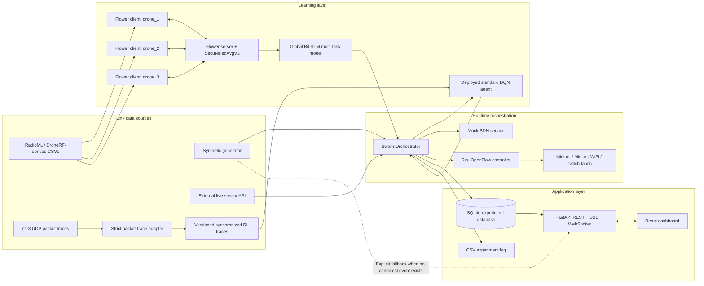
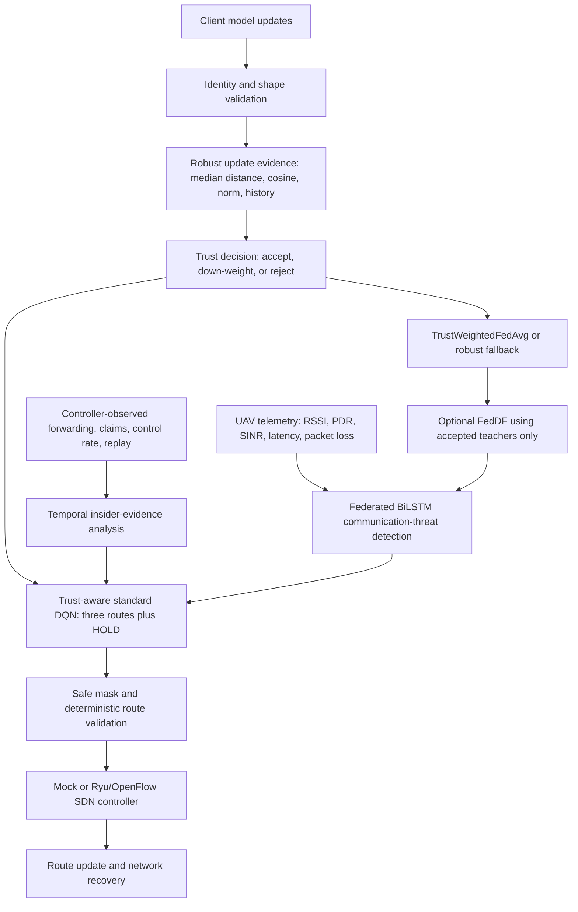
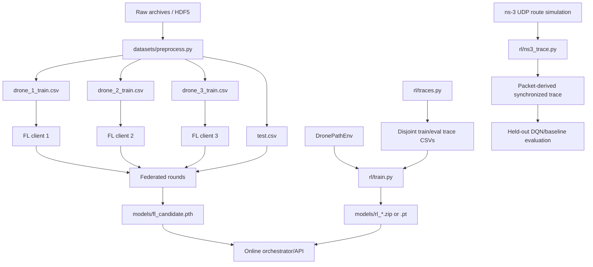
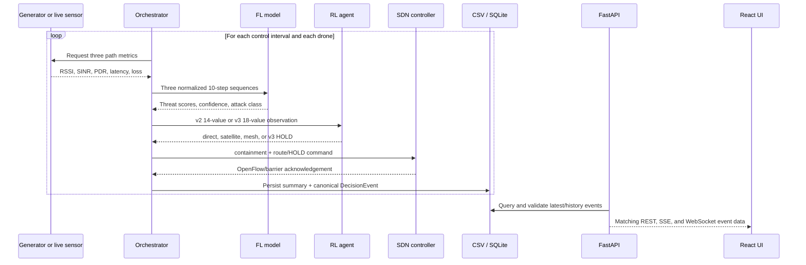
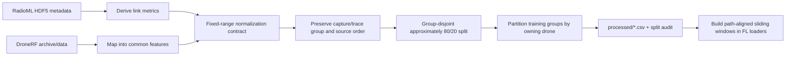
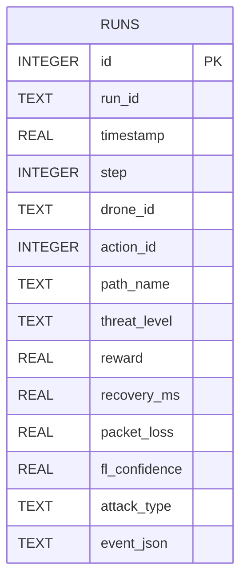
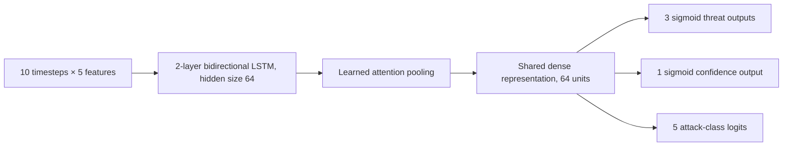
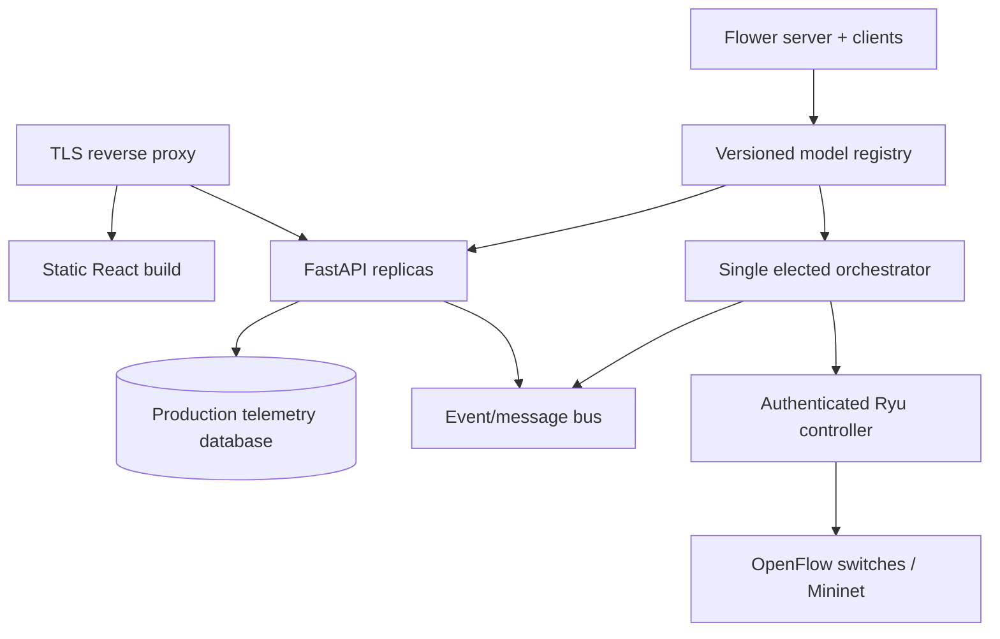

# FLARE: Cross-Layer Cyber-Resilience for UAV Swarms

FLARE is a research-oriented prototype with separate communication-threat, network/traffic-evidence, and federated-update security paths. A five-feature federated BiLSTM detects communication anomalies; explicit source-labelled analyzers score traffic-insider, DoS, and network/telemetry-spoofing evidence; Byzantine-resilient aggregation protects collaborative training; and a standard DQN selects among three routes plus a v3 HOLD action. Deterministic safety validation and SDN then request forwarding, restriction, quarantine, or fail-closed hold. Mock SDN is simulated enforcement; packet behavior is only claimed when the Ryu/Mininet gate passes.

> **Canonical research source:** [`docs/canonical_research_story.md`](docs/canonical_research_story.md) contains the report/PPT-ready problem statement, objectives, methodology, terminology, feature definition, contribution mapping, limitations, and final contribution statement. Code is the source of truth when any older generated artifact differs.

> **Project status:** This repository is a capstone/research prototype, not a production-ready network controller. The principal host-native simulation workflow has been exercised end to end, including federated training, RL inference, orchestration, authenticated APIs, mock SDN routing, persistence, and the React dashboard. Development/production-like container layouts and CI checks are also defined. Several advanced FL features and real-network integrations remain experimental. These distinctions are called out throughout this README.

## Table of contents

1. [Project overview](#project-overview)
2. [Architecture](#architecture)
3. [End-to-end data flow](#end-to-end-data-flow)
4. [Project structure](#project-structure)
5. [Technologies and dependencies](#technologies-and-dependencies)
6. [How the project works](#how-the-project-works)
7. [Important code and algorithms](#important-code-and-algorithms)
8. [Design decisions and trade-offs](#design-decisions-and-trade-offs)
9. [Datasets and preprocessing](#datasets-and-preprocessing)
10. [Database](#database)
11. [APIs](#apis)
12. [Authentication and security](#authentication-and-security)
13. [AI and ML components](#ai-and-ml-components)
14. [Setup and installation](#setup-and-installation)
15. [Running the project](#running-the-project)
16. [Configuration](#configuration)
17. [Testing and evaluation](#testing-and-evaluation)
18. [Deployment](#deployment)
19. [Error handling and troubleshooting](#error-handling-and-troubleshooting)
20. [Performance and scalability](#performance-and-scalability)
21. [Limitations and known issues](#limitations-and-known-issues)
22. [Future improvements](#future-improvements)
23. [Explaining FLARE in an interview](#explaining-flare-in-an-interview)

## Project overview

### What FLARE does

FLARE models a swarm in which each drone can communicate with a base station through one of three logical paths:

| Path | Intended characteristic | Simulated trade-off |
|---|---|---|
| `direct` | Low-latency direct radio link | Lowest normal latency, but potentially easy to jam |
| `satellite` | Long-range alternate route | Resilient alternative with high latency and energy cost |
| `mesh` | Multi-hop drone network | Middle-ground latency, but the highest configured energy cost |

For every drone, FLARE collects or generates link measurements, estimates the threat on each path, chooses a route, asks the SDN layer to install it, and records the outcome. The dashboard lets an operator observe the swarm and trigger simulated attack profiles.

### Problem it addresses

Static wireless routes respond poorly to changing interference, while ordinary FedAvg can be corrupted by a compromised swarm member that submits poisoned parameters. Centralizing raw radio data is also undesirable in a distributed swarm because of bandwidth, latency, and privacy constraints, and heterogeneous RF exposure creates non-IID client drift.

FLARE explores two complementary ideas:

- **Federated communication-threat detection:** drones train locally over five link metrics and share model parameters rather than raw samples.
- **Insider-resistant collaboration:** the server analyzes model deltas, tracks historical trust, and down-weights or rejects Byzantine updates.
- **Adaptive recovery:** a deployed standard DQN balances throughput, delay, loss, energy use, and route-switching cost before a safety gate and SDN enforcement.

### Why the project was built

The implementation supports a cross-layer communication-resilience and secure-federation research story. Optional modules such as privacy, personalization, and client selection remain experimental and are not presented as validated core contributions.

### Main goals and use cases

- Demonstrate communication-threat-aware recovery for a small drone swarm.
- Train a multi-task threat model without pooling all client data.
- Protect Flower aggregation against poisoned client updates.
- Measure legitimate non-IID drift and the false-positive cost of Byzantine detection.
- Compare learned routing with greedy and static baselines.
- Test behavior under synthetic and dataset-derived link conditions.
- Visualize route, threat, attack, FL, and explanation data.
- Provide mock, Ryu/OpenFlow, Mininet, Mininet-WiFi, and ns-3-oriented integration points.

### What FLARE is not

- It is not a flight controller and does not command drone movement.
- It does not implement real RF signal capture or radio-frequency hopping.
- Its controller-evidence insider classifier is simulation-validated, not a claim of representative operational traffic detection.
- Trust-aware routing and containment require a valid `routing_state_v3` checkpoint; the runtime safely falls back to the versioned v2 contract if it is absent.
- The default workflow uses synthetic link metrics.
- It does not yet provide production-grade identity, secrets, durability, or high availability.
- Some research modules exist as utilities but are not connected to Flower's live round lifecycle; these are identified below.

### Promoted evidence

Historical files under `results/` are not current evidence unless they have a matching, hash-valid `.provenance.json` sidecar. The generated block below lists only explicitly promoted artifacts; it must not be treated as real-world performance evidence when its category is controlled simulation. `scripts/update_readme_metrics.py` fails closed if a report, protocol input, checkpoint, dataset, or sidecar is missing or stale.

<!-- PROMOTED-EVIDENCE:START -->
| Evidence set | Promoted run | Category | Seeds | Report SHA-256 |
|---|---|---|---|---|
| Network DoS/spoofing detector | `20260915T082949.225063Z-37e96820b9bc` | `controlled_simulation` | `[7, 42, 99]` | `e32c229bde7a772c08e9de2d0a7cb74dd97b92e6169d564e8c47c13b12c54359` |
<!-- PROMOTED-EVIDENCE:END -->

Current implementation checks may be reported from fresh command output, but numerical research-performance claims must come from this promoted evidence chain. Packet-level OpenFlow, wireless/RF, and hardware evidence remain separate validation categories.

## Architecture

### Overall system



### Components and responsibilities

| Component | Responsibility | Runtime relationship |
|---|---|---|
| Simulation generator | Produces RSSI, SINR, packet delivery ratio (PDR), latency, and loss for all three paths | Used by the orchestrator; used directly by the API only when no canonical event exists |
| Jammer state | Stores the active attack profile and target as JSON | Read by the generator; written by the API or jammer CLI |
| Flower clients | Train the PyTorch model on per-drone synthetic or processed data | Exchange parameters and metrics with the Flower server |
| Flower server | Aggregates clients, tracks trust/drift, optionally distills, evaluates, and saves the global model | Produces the checkpoint used for inference |
| Synchronized trace contract | Stores all three route states for one timestamp in each versioned/fingerprinted row | Used only for offline RL training, checkpoint selection, and robustness evaluation |
| ns-3 packet trace pipeline | Sends UDP traffic over distinct point-to-point route models, records packet counters/delay/throughput, validates derived metrics, and converts them to the synchronized contract | Used for held-out packet-level evaluation; not used by the online control loop or current training checkpoint |
| RL environment/agent | Converts threat and network state into a route action | Called once per drone by the orchestrator |
| Orchestrator | Coordinates sensing, FL inference, RL decision, SDN update, and logging | Main control loop, normally every 0.5 seconds |
| Mock SDN | Emulates route changes in memory | Default local simulation target |
| Ryu controller | Installs OpenFlow 1.3 forwarding rules | Intended for Mininet or compatible switches |
| SQLite/CSV | Persist compact experiment summaries; SQLite also stores the full canonical decision event | Read by API history, status, streams, and reports |
| FastAPI | Exposes authentication, prediction, metrics, attack control, reporting, SSE, and WebSocket telemetry | Backend consumed by the React UI |
| React dashboard | Operator view and attack/configuration controls | Uses REST and WebSocket endpoints |

### Cross-layer security flow



The preferred `routing_state_v3` contract consumes server trust, insider risk, containment severity, and evidence freshness through four added state values. Its checkpoint is trained separately from the legacy v2 route policy and is bound to 18 inputs/4 actions by metadata. If that checkpoint is absent, runtime fallback to `routing_state_v2` is explicit: v2 does not consume trust and retains its historical 14-input/3-route semantics. The RF threat model itself detects communication anomalies; insider traffic evidence remains a separate, controller-corroborated analyzer.

### Offline training and online control are separate

The Flower server trains and writes the non-deployed `models/fl_candidate.pth`. The orchestrator and API load the last manifest-approved generation (or the legacy bootstrap checkpoint when no manifest exists); they do not participate in a live FL round on every routing decision. Similarly, `rl/train.py` trains an RL candidate offline, while `RLAgent` loads only the approved runtime generation.



## End-to-end data flow

### Online routing loop



The detailed steps are:

1. `SwarmOrchestrator` reads `config/mode.yaml`.
2. In `simulation` mode, it generates one swarm snapshot from one jammer-state read. In `real` mode, it concurrently awaits the three `AJ_SENSOR_API_URL/metrics?drone_id=...` responses and falls back per drone on failure.
3. The orchestrator appends each path's normalized features to a per-drone rolling 10-timestep buffer. Startup windows are left-padded with the earliest real observation; full windows contain ten chronological measurements.
4. The FL model returns three threat values, one confidence value, and five attack logits per input sequence. The orchestrator batches one sequence for each active-drone/path pair into one model call, then uses each sequence's mean threat-head output as that path's score. It also forces a score of at least `0.95` when raw PDR is below `0.4`.
5. The orchestrator separately analyzes controller-observed forwarding/control counters for insider behavior and reads the latest server-authenticated FL trust. Under `routing_state_v3`, the RL agent receives those four cross-layer security values in addition to the v2 QoS state.
6. `rl/safety.py` applies the configured threat constraint. An unsafe forwarding choice is replaced with a safe route when possible. The v3 contract converts all-routes-unsafe or quarantine decisions into executable action 3 (`hold`); v2 retains the identified least-risk compatibility behavior.
7. Containment and the selected route/HOLD command are sent to SDN. Mock and Ryu implementations acknowledge normal, restricted/control-only, quarantined, and fail-closed states; Ryu uses explicit empty-action drop rules and barriers.
8. The installed/effective route is scored with the same shared throughput, delay, energy, packet-loss, and switching formula used during RL training. The resulting total becomes the next RL observation's previous reward.
9. For each drone, the orchestrator validates a versioned `DecisionEvent` containing the exact telemetry snapshot, FL outputs, RL observation/source, requested and installed routes, SDN result, reward breakdown, timing, checkpoint hashes, and fallback reasons.
10. The three compact summaries plus their `event_json` payloads are written with one CSV open and one SQLite transaction on a worker thread. CSV intentionally remains compact and does not duplicate the JSON payload.
11. REST metrics/status/history, SSE, and WebSocket telemetry read the persisted event. They no longer generate a second random snapshot for a decision that was made from different data. If no canonical event exists—for example before the orchestrator starts—the API marks generated data as `legacy_api_fallback`.

## Project structure

Generated dependencies, external simulators, datasets, checkpoints, logs, and first-party source coexist in this working tree. The important project-owned structure is:

```text
Capstone/
├── .github/workflows/ci.yml        # Python, frontend, and Compose validation in GitHub Actions
├── .env.example                    # Documented, non-secret environment template
├── api/
│   ├── __init__.py
│   ├── readiness_history.py       # Bounded, deduplicated SDN transition history
│   └── server.py                  # FastAPI application and all public/protected endpoints
├── baselines/
│   ├── __init__.py
│   ├── fl_baseline.py             # Centralized logistic-regression/random-forest comparisons
│   └── rl_baseline.py             # Paired greedy/myopic/static/random routing comparisons
├── config/
│   ├── fl_config.yaml             # FL privacy, aggregation, trust, drift, KD, etc.
│   ├── mode.yaml                  # simulation or real data-source selection
│   ├── rl_config.yaml             # RL algorithm, environment, and training settings
│   └── sdn_config.yaml            # SDN host, port mapping, priorities, failover
├── datasets/
│   ├── README.md                   # Dataset-specific usage notes
│   ├── download.py                # Dataset download and synthetic fallback helper
│   ├── preprocess.py              # Raw-data loading, feature derivation, split, partition
│   ├── raw/                       # Download destination; large/generated
│   └── processed/                 # Per-drone train CSVs, test CSV, statistics
├── docker/
│   ├── Dockerfile.api             # API/orchestrator Python image
│   ├── Dockerfile.fl              # Flower server/client image
│   ├── Dockerfile.sdn             # Ryu controller image
│   ├── Dockerfile.mininet         # Privileged Mininet image
│   ├── Dockerfile.frontend        # Multi-stage Vite build and Nginx runtime
│   └── nginx.conf                 # SPA fallback, cache, and browser security headers
├── experiments/
│   └── experiment.db              # Runtime SQLite artifact
├── fl/
│   ├── model.py                   # BiLSTM attention multi-task PyTorch network
│   ├── client.py                  # Flower NumPyClient and data loading/training
│   ├── server.py                  # SecureFedAvgV2 strategy and Flower entry point
│   ├── data.py                    # Shared temporal windows, normalization, and group split
│   ├── partitioning.py            # Group-safe IID/Dirichlet and RF feature-skew simulation
│   ├── checkpoint.py              # Temporal FL checkpoint compatibility metadata
│   ├── aggregator.py              # Clipping, anomaly filtering, robust/trust aggregation
│   ├── privacy.py                 # Opacus integration and simplified DP accounting
│   ├── compression.py             # Top-k/int8/error-feedback parameter compression
│   ├── distillation.py            # FedDF-style server knowledge distillation
│   ├── personalization.py         # Local head adaptation utility
│   ├── selection.py               # PoCo/UCB client-selection utility
│   ├── async_fl.py                # FedBuff-style asynchronous buffer utility
│   ├── drift.py                   # Per-client distribution drift tracking
│   ├── metrics.py                 # Round metrics and JSON export
│   └── trust.py                   # Client trust scoring and quarantine state
├── frontend-react/
│   ├── src/App.tsx                # Main dashboard, API calls, WebSocket, and controls
│   ├── src/TelemetryCharts.tsx    # Lazy-loaded Recharts telemetry visualizations
│   ├── src/main.tsx               # React application bootstrap
│   ├── src/index.css               # Tailwind import and global styling
│   ├── src/App.css                 # Scaffold/legacy component styles
│   ├── package.json                # Frontend scripts and dependencies
│   ├── vite.config.ts              # Vite configuration
│   └── dist/                       # Generated production bundle after npm run build
├── logs/                           # Generated service and experiment CSV logs
├── models/                         # Generated FL/RL checkpoints
├── orchestrator/
│   └── loop.py                     # Main closed-loop runtime coordinator
├── rl/
│   ├── env.py                      # 14-feature Gymnasium routing environment
│   ├── agent.py                    # Runtime DQN/SAC loader and constrained decision wrapper
│   ├── checkpoint.py               # Versioned, hash-bound RL checkpoint metadata
│   ├── evaluation.py               # Paired seeded learned/greedy/static/random evaluation
│   ├── ns3_trace.py                 # Strict ns-3 packet JSON validation and RL trace conversion
│   ├── reward.py                   # Shared training/runtime QoS reward and constants
│   ├── safety.py                   # Safe-route mask, override, and all-routes-unsafe state
│   ├── sac_discrete.py             # Custom categorical SAC, replay buffer, twin critics
│   ├── traces.py                    # Versioned synchronized three-path trace contract/generator
│   └── train.py                    # DQN or discrete-SAC training
├── schemas/
│   ├── __init__.py                 # Shared runtime contract exports
│   ├── decision_event.py           # Strict Pydantic canonical event and telemetry models
│   ├── metrics.json                # JSON Schema for path metrics and provenance
│   ├── routing_decision.json       # Documentation/schema artifact for decisions
│   └── threat_scores.json          # Documentation/schema artifact for threats
├── pytest.ini                      # Limits normal pytest discovery to project tests
├── scripts/
│   ├── train_all.sh                # Dataset, FL, RL, and evaluation pipeline
│   ├── evaluate.py                 # Model/baseline metrics, report, and plots
│   ├── generate_ns3_traces.py       # Build/run packet simulator and create synchronized traces
│   ├── migrate_experiment_db.py    # Dry-run/backup-first repair for historical DB rows
│   ├── rl_seed_study.py             # Multi-training-seed/OOD DQN robustness study
│   ├── test_model_with_ns3.py      # Evaluate the deployed DQN on packet-derived traces
│   ├── run_byzantine_experiment.py # Clean/attacked FedAvg versus secure aggregation
│   ├── run_fl_resilience_matrix.py # IID/non-IID, poisoning, FedDF, drift, and ablation matrix
│   └── sdn_smoke_test.sh           # Privileged concurrent-route/data-plane/failover test
├── sdn/
│   ├── controller.py               # Ryu OpenFlow 1.3 REST controller
│   ├── flow_manager.py             # Flow installation, priorities, and failover
│   ├── mock_sdn.py                 # In-memory SDN HTTP API
│   ├── route_contract.py            # Canonical path/action/drone mapping
│   ├── topology_state.py            # Switch inventory and per-route port availability
│   ├── mininet_topo.py             # Wired three-route Mininet topology
│   └── mininet_wifi_topo.py        # Ad-hoc Wi-Fi topology and netem attacks
├── simulation/
│   ├── generator.py                # Synthetic metrics and attack effects
│   ├── jammer.py                   # Jammer CLI, profiles, reactive/adaptive modes
│   ├── digital_twin.py             # Lightweight predicted-state environment
│   ├── ns3/flare_packet_trace.cc   # Reproducible three-path UDP packet simulation
│   └── jam_state.json              # Current generated jammer state
├── tests/
│   ├── test_api_client.py          # Authentication/protected API smoke client
│   ├── test_adversarial.py         # Adversarial FL and simulator tests
│   ├── test_ew_api.py              # Electronic-warfare API tests
│   ├── test_fl_api.py              # FL configuration/metrics API tests
│   ├── test_phase1_regressions.py  # Correctness/data-integrity regression suite
│   ├── test_phase2_security.py     # Auth, CORS, config, stream, and SDN security tests
│   ├── test_phase3_ml_correctness.py # FL data/loss/privacy/aggregation regressions
│   ├── test_phase4_performance.py  # Batching, async sensor, sensitivity, and persistence tests
│   ├── test_phase5_reward_consistency.py # Training/runtime reward parity and transition tests
│   ├── test_phase6_temporal_data.py # Temporal ordering, leakage, runtime, and FL metadata tests
│   ├── test_phase7_rl_evaluation.py # Initial-state and paired seeded RL evaluation tests
│   ├── test_phase8_synchronized_rl_traces.py # Trace contract/replay/split regressions
│   ├── test_phase9_ns3_packet_traces.py # Raw packet contract/conversion/filter regressions
│   ├── test_phase10_constrained_routing.py # Route constraints and mixture-provenance regressions
│   ├── test_phase11_sdn_correctness.py # SDN contract, replacement, and real-data deployment guards
│   ├── test_phase12_sdn_readiness.py # Switch/port readiness and failover regressions
│   ├── test_phase13_system_readiness.py # API/controller readiness contract regressions
│   ├── test_phase14_operational_readiness.py # Transition history and alert regressions
│   ├── test_byzantine_aggregation.py # Trust/update-security and benchmark regressions
│   └── test_non_iid_fl.py          # Partition, RF-skew, and secure non-IID tests
├── .github/workflows/
│   ├── ci.yml                      # Python, frontend, and Compose checks
│   └── sdn-integration.yml         # Path-filtered privileged SDN integration tier
├── mininet-wifi/                   # Vendored external Mininet-WiFi source tree
├── ns-3-dev/                       # Vendored external ns-3 source tree and scratch program
├── docker-compose.dev.yml          # Development composition
├── docker-compose.prod.yml         # Ryu/Mininet-oriented composition
├── run_local_simulation.sh         # Starts local backend services
├── stop_local_simulation.sh        # Stops services recorded in the PID file
├── requirements.txt                # Python dependency ranges
└── README.md                       # This document
```

The vendored `mininet-wifi/` and `ns-3-dev/` trees and the local raw datasets are large third-party areas. Generated `venv/`, `frontend-react/node_modules/`, logs, database files, and model checkpoints may appear after setup or execution; they are ignored and should not be treated as application modules when navigating the first-party design.

## Technologies and dependencies

### Backend, learning, and data stack

| Technology | Declared requirement | Role | Why it is suitable here |
|---|---:|---|---|
| Python | Docker images use 3.11; SDN image uses 3.9 | Main implementation language | Strong ML, networking, simulation, and API ecosystems |
| PyTorch | `>=2.1` | FL model, custom SAC, tensor operations | Flexible multi-output networks and explicit training loops |
| Flower | `>=1.7` | Federated client/server protocol | Provides round coordination and parameter transport without building an FL protocol from scratch |
| NumPy | `>=1.24` | Feature arrays, aggregation, simulation | Efficient numerical interchange across ML modules |
| pandas | `>=2.0` | CSV preprocessing and analysis | Convenient tabular joins, splitting, and reporting |
| SciPy | `>=1.11` | Scientific/statistical support | Supports experiment analysis and numerical utilities |
| scikit-learn | Unpinned in `requirements.txt` | Splits, metrics, centralized baselines | Standard implementations for stratification and evaluation |
| h5py | `>=3.9` | RadioML HDF5 access | Reads the source dataset format directly |
| Gymnasium | `>=0.29` | RL environment contract | Compatible state/action interface for Stable-Baselines3 |
| Stable-Baselines3 | `>=2.2` | DQN training and inference | Provides a tested discrete-action DQN implementation |
| Opacus | `>=1.4` | Optional client differential privacy | Adds PyTorch-oriented gradient clipping/noise machinery |
| FastAPI | `>=0.110` | REST, docs, auth, streaming backend | Pydantic validation and asynchronous HTTP/WebSocket support |
| Uvicorn | `>=0.27` | ASGI server | Lightweight development/production process host for FastAPI |
| Pydantic | `>=2.0` | API and canonical event validation | Expresses request and cross-component runtime contracts in Python types |
| `python-jose` | `>=3.3` | JWT creation and verification | Implements the current stateless bearer-token scheme |
| Passlib | `>=1.7` | Password hashing | Provides PBKDF2-SHA256 verification for the configured operator account |
| `sse-starlette` | `>=2.0` | Server-sent event endpoint | Simple unidirectional live updates |
| `aiosqlite` | `>=0.19` | Async API reads from SQLite | Avoids blocking API handlers during database access |
| HTTPX / Requests | `>=0.26` / `>=2.31` | Internal service calls | HTTPX supports async API/orchestrator calls; Requests supports scripts/downloads |
| PyYAML | `>=6.0` | Configuration | Human-readable experiment configuration |
| Matplotlib / Seaborn | `>=3.8` / `>=0.13` | Evaluation plots | Standard scientific report graphics |

`tenacity` and `jsonschema` are declared but are not central to current runtime behavior. Pydantic actively validates the canonical decision event; standalone JSON Schema files primarily support documentation and non-Python consumers.

### Frontend stack

| Technology | Version in `package.json` | Role and rationale |
|---|---:|---|
| React / React DOM | `19.2.7` | Component/state model for the live dashboard |
| TypeScript | `~6.0.2` | Static checking for frontend data and UI logic |
| Vite | `8.1.1` | Fast development server and production bundling |
| Tailwind CSS | `4.3.2` | Utility styling for the dashboard layout |
| Recharts | `3.9.2` | Telemetry and FL charts |
| Lucide React | `1.24.0` | Consistent dashboard icons |
| Oxlint | `1.71.0` | Frontend linting |

### Networking and infrastructure

- **Ryu and OpenFlow 1.3** translate a logical route into switch flow rules. Ryu is commented out in the shared Python requirements and installed only in the SDN Docker image because of its older compatibility constraints.
- **Mininet** provides a reproducible wired virtual topology; **Mininet-WiFi** provides ad-hoc wireless nodes and Linux `tc netem` impairment.
- **ns-3** is included for packet-level network experiments. The vendored tree identifies itself as an ns-3.48 development revision. `simulation/ns3/flare_packet_trace.cc` creates UDP flows over independent direct/satellite/mesh point-to-point links with seeded packet error models. A separate `simulation/ns3/flare_wifi_mobility.cc` models one two-node 802.11b moving-away link. Neither study is a representative UAV RF capture, wireless three-route policy evaluation, interference/contending swarm model, or hardware experiment.
- **SQLite** is a zero-administration experiment store suited to a single-process prototype.
- **Docker Compose** describes repeatable multi-service development and production-like layouts.
- **Redis** appears as an optional development service, but current first-party code does not use it.

## How the project works

### 1. Attack selection and metric generation

`simulation/jammer.py` recognizes the implemented communication profiles `none`, `spot`, `sweep`, `barrage`, `smart`, `reactive`, `adaptive`, `fhss`, `spoofing`, `gps_spoofing`, `replay`, and `dos`. It writes the active state to `simulation/jam_state.json`. Strong model-update poisoning is implemented separately in `fl/client.py`, `simulation/byzantine_state.py`, and the Byzantine experiment/control API. Sybil, local-data-poisoning, and backdoor attacks are not implemented and are not exposed as working controls.

`simulation/generator.py` reads that file and generates metrics for every path. Examples:

- `barrage` degrades all paths.
- `sweep` rotates the attacked path roughly every three seconds.
- `smart` can preserve RSSI while reducing PDR, making simple power thresholds less useful.
- `fhss` is modeled as avoiding degradation.
- `spoofing` can advertise unrealistically favorable measurements.
- `dos` raises delay and loss.
- `replay` returns cached healthy-looking values.

The API's `/jam` endpoint writes state only. The jammer CLI contains additional reactive/adaptive loops; invoking the API does not automatically run those background algorithms.

### 2. Threat inference

The five values `[rssi, pdr, sinr, latency, packet_loss]` are normalized with fixed physical ranges. Offline loaders create sliding windows within one source capture, drone, and path; runtime inference keeps the equivalent rolling per-drone/per-path history. The label belongs to the final row of each window, so earlier observations never receive a future target. The BiLSTM predicts:

- three redundant threat probabilities whose mean is used for the current path,
- one learned prediction-correctness confidence score, and
- one of five attack classes.

If the FL checkpoint is absent or inference fails, the orchestrator uses a deterministic, inspectable weighted heuristic over RSSI, PDR, SINR, latency, and packet loss. It records `heuristic_fallback` and a reason in the canonical event instead of producing random threat scores.

### 3. RL state and route choice

`DronePathEnv` preserves the deployed v2 action space:

```text
0 = direct, 1 = satellite, 2 = mesh
```

Its 14-value observation is:

```text
[threats(3), latencies(3), losses(3), previous_action_one_hot(3),
 previous_reward(1), normalized_step(1)]
```

At the first decision, all three previous-action values are zero to mean “no route selected yet.” After a decision, exactly one becomes one. This matches the reward contract: the first action has no switching penalty, while later route changes do.

`TrustAwareDronePathEnv` defines the separately versioned v3 contract. It appends `[client_trust, insider_risk, containment_score, evidence_freshness]` for 18 inputs and adds action `3 = hold`. HOLD receives an availability penalty but avoids the larger penalty assigned to forwarding traffic for a participant with corroborated malicious evidence.

The reward encourages throughput and penalizes delay, energy, packet loss, and switching:

```text
reward = throughput
         - 0.6 * delay
         - 0.3 * energy
         - 0.8 * packet_loss
         - 0.15 * switched_path
```

The configured energy costs are approximately `0.2` for direct, `0.6` for satellite, and `0.9` for mesh. The weights encode a project preference for reliability while discouraging expensive or unstable routing.

`rl/reward.py` is the single implementation of this formula. `DronePathEnv` scores the state visible to the policy before evolving the RF state for the next observation; the orchestrator uses the same normalized latency/loss inputs and switching semantics. Canonical events identify the formula as `routing_qos_v2` and retain every normalized input, contribution, penalty, and total. This removes the previous runtime shortcut that used only threat and path index.

`rl/evaluation.py` compares the raw DQN, the deployed DQN plus the shared route constraint, lowest-threat greedy, an immediate-reward oracle, static-direct, and random routing. Every policy is reset with the same per-episode seed, so it sees identical exogenous RF traces; paired reward differences are reported with 95% confidence intervals. Reports separately count changed policy actions (`safety_override_count`) and states where every route exceeds the threshold (`no_safe_route_count`/`no_safe_route_pct`).

For replay and robustness work, `rl/traces.py` defines the strict `synchronized_three_path_v1` CSV contract. One row contains direct, satellite, and mesh threat, normalized latency, packet loss, and ground-truth jam flags for the same decision timestep, plus scenario, episode, step, source, and generation-seed provenance. Validation rejects missing routes, invalid ranges, duplicate/gapped steps, mixed episode metadata, and overlapping train/evaluation episode IDs. `generate_scenario_mixture_trace` combines exact per-scenario episode counts using deterministic, separated seed ranges, and checkpoint provenance records those distributions. `SynchronizedTraceDronePathEnv` replays values exactly—there is no interpolation or random path perturbation. These generated traces are deterministic fixtures, not radio captures.

### 4. SDN application

For local work, `sdn/mock_sdn.py` accepts route, HOLD, and containment commands and remembers independent state per drone. `sdn/route_contract.py` gives action/path pairs one shared definition and both controllers reject mismatches. With Ryu, `sdn/controller.py` delegates flow construction to `sdn/flow_manager.py`: routes use output actions, HOLD/quarantine use empty-action drops, and restricted/control-only mode permits configured telemetry UDP ports before a higher-priority drop. `sdn/topology_state.py` requires all expected switches and port inventories, derives per-drone route availability from OpenFlow port state, and fails closed while topology state is incomplete. After each update, the controller waits for OpenFlow barrier replies from all five switches before reporting success.

The Ryu evidence endpoint labels ingress flow counters separately from registry-bound ingress-port receive drops/errors. `controller_policy_dropped_packets` counts installed HOLD/containment drop-flow packets and is **not** scored as DoS loss. Fresh port statistics expose cumulative totals with `drop_counter_semantics=ingress_port_receive_drop_error`; the version-2 network detector scores only a valid, at-most-three-second delta between consecutive port samples. A first sample, counter reset, stale sample, or unsupported port signal supplies no DoS loss window rather than a fabricated zero or a policy-drop fallback. Its compatible `control_messages_per_s` field counts access-port OpenFlow `PacketIn` events, **not** FLARE's own route/containment REST commands, and includes `control_rate_observer=access_port_packet_in`. A source MAC is marked observed only when a fresh `PacketIn` on a registry-bound port supplies it; the expected MAC in a flow match is not independent identity observation. Real-mode evidence joins reject malformed counters and RF/controller timestamps more than three seconds apart. MAC/port binding is still not device authentication or radio attestation.

The wired Mininet topology creates one host per enabled fleet-registry identity at startup and connects each to its configured ingress access port. Three middle switches have representative link properties:

- direct: about 10 ms and 100 Mbit/s,
- satellite: about 300 ms, 10 Mbit/s, and 1% loss on its first link,
- mesh: about 50 ms, 20 Mbit/s, and 0.5% loss.

### 5. Persistence and visualization

The orchestrator appends compact summaries to CSV and writes the same summaries plus a validated `DecisionEvent` JSON document to SQLite. FastAPI validates those events again when it reads them and uses their exact telemetry for live metrics, swarm metrics/status, history, SSE, and WebSocket output. The dashboard authenticates, opens a WebSocket, renders the topology and gauges, exposes attack buttons and FL settings, and can request an HTML experiment report. Drone selection is tracked through a React ref so an existing WebSocket handler always follows the currently selected drone without reconnecting.

## Important code and algorithms

### Key runtime symbols

| Symbol | Responsibility and connection |
|---|---|
| `generate_metrics` / `generate_swarm_metrics` | Read jammer state and create one-drone or whole-swarm path telemetry for the orchestrator/API |
| `build_temporal_windows` | Sorts rows within capture/drone/path groups, creates sliding windows, and aligns labels to each window's final row |
| `split_by_sequence_group` | Selects a deterministic held-out set containing whole source captures/traces and verifies no train/test group overlap |
| `metrics_to_tensor` | Converts rolling telemetry history into canonical direct/satellite/mesh sequences with startup left-padding |
| `jam_paths` / `clear_jamming` | CLI-oriented state control, including reactive/adaptive worker behavior and timed clearing |
| `BiLSTMAttention.forward` | Produces the structured threat, confidence, and attack outputs consumed by FL training and inference |
| `DroneFlClient.fit` | Executes local Flower training, optional privacy/personalization/compression, and metric reporting |
| `SecureFedAvgV2.aggregate_fit` | Coordinates trust, drift, quarantine, robust aggregation, distillation, checkpointing, and evaluation for a round |
| `secure_aggregate` | Clips client deltas, filters statistical outliers, chooses trust/trimmed/FedAvg aggregation, and optionally adds noise |
| `DronePathEnv.step` / `TrustAwareDronePathEnv.step` | Preserve v2 14-input/3-action behavior or execute the v3 18-input/4-action security contract |
| `compute_routing_reward` | Produces the shared, inspectable QoS reward used in training and live orchestration |
| `SynchronizedTraceDronePathEnv` | Strictly replays complete, versioned three-route timesteps and terminates at the trace episode boundary |
| `RealDataDronePathEnv` | Backward-compatible import name for `SynchronizedTraceDronePathEnv`; it no longer accepts the single-link FL `test.csv` or fabricates route variants |
| `generate_synchronized_trace` / `generate_scenario_mixture_trace` | Produce deterministic single-scenario or exact-distribution three-path traces |
| `validate_disjoint_trace_files` | Proves training/evaluation episode identities and content are disjoint and records per-scenario counts |
| `constrain_route_action` | Builds a safe-action mask, replaces an unsafe choice when possible, and marks an all-routes-unsafe degraded state |
| `RLAgent.predict` | Validates checkpoint-bound v2/v3 state, predicts with standard DQN, fuses trust/insider containment in v3, and applies the shared route/HOLD constraint |
| `Orchestrator._run_step` | Runs the per-drone sensing → FL → RL → SDN → persistence pipeline |
| `DecisionEvent` / `TelemetrySnapshot` | Strict, versioned runtime contracts that reject incomplete paths, invalid ranges, non-finite numbers, or unknown fields |
| `AntiJammingController.apply_routing_decision` | Converts an SDN REST decision into flow installation on every connected Ryu datapath |
| `install_flow` / `select_safe_path` | Map paths to configured ports and provide deterministic failover |
| `lifespan` / `telemetry_broadcaster` | Load API-side models once and publish dashboard messages in the background |
| `_latest_decision_events` | Reads and revalidates the newest canonical event for each drone before API/stream delivery |
| `integrated_gradients` / `_calculate_model_explanation` | Explain a specific threat/attack output or DQN Q value with signed temporal attribution and completeness error; return no fabricated fallback |
| `SwarmStateRegistry` | Maintains the optional digital-twin state and short-horizon predictions |

### Federated client training

`FLClient.fit` loads server weights, trains locally, applies optional privacy/compression logic, and returns new arrays plus metrics. The training loss is currently:

```text
2.0 * binary_cross_entropy(threat_output, threat_target)
+ 0.5 * cross_entropy(attack_logits, attack_class)
+ 0.2 * mean_squared_error(confidence, current_prediction_correctness)
```

The confidence target is the mean of current threat-head correctness and attack-class correctness, detached from the gradient graph. This gives the confidence head an explicit signal. Evaluation reports its Brier score (lower is better); the head still needs calibration on representative held-out data before its values should drive safety decisions.

Synthetic client and distillation data now generate correlated random-walk sequences with stable seeds. Processed CSVs carry `sequence_group` and `sequence_index`; the loader creates chronological sliding windows without crossing capture, drone, or path boundaries. Preprocessing assigns whole groups to train or test, preserves client ownership instead of padding one drone with another drone's rows, and records the zero-overlap audit in `dataset_stats.json`. The latest 50,000-row fallback preprocessing produced 800 train groups and 200 test groups with zero overlap; those 10,000 test rows yield 8,200 complete windows. The final row's binary label is still copied across the model's three threat heads because runtime evaluates one path per sequence and averages those heads; this keeps path alignment but leaves the three heads architecturally redundant.

### Secure and robust aggregation

`SecureFedAvgV2.aggregate_fit` performs the following broad sequence:

1. Bind the Flower connection to an allowed drone identity and reject a connection that changes identity or duplicates another drone within the round.
2. Convert every submitted model into a finite, shape-checked update delta relative to the current global model.
3. Compare each delta with the coordinate-wise median update using distance, cosine direction, and update norm.
4. Normalize those signals with median/MAD statistics (and IQR or majority-relative fallbacks when MAD is zero).
5. Combine current-round evidence with persisted historical trust to accept, down-weight, quarantine, or reject each client.
6. Cap self-reported sample counts using the population median/IQR and a configurable median ratio, then derive an adaptive robust norm bound and clip surviving deltas.
7. Apply effective-sample-count × trust weighting, or switch to coordinate-wise median/trimmed mean when the configured suspicious-client fraction is reached.
8. Add optional server-side Gaussian noise, then save and evaluate the model.

The production Flower strategy uses `TrustWeightedAggregationStrategy`; the older `secure_aggregate` function remains for compatibility and for explicitly disabled trust mode. Rejected models are also removed from the optional knowledge-distillation teacher ensemble, preventing that path from bypassing the aggregation decision.

### Trust and quarantine

`UpdateAnalyzer` calculates server-side evidence, so an insider cannot improve its aggregation weight by claiming a false local accuracy. `TrustManager` applies an exponential moving average to that evidence and keeps bounded update-norm and deviation histories. In a tightly clustered round, a strong single-signal warning can reduce influence; when measured population dispersion indicates heterogeneous clients, a warning requires corroborating signals, a longitudinal jump, or a sufficiently opposing direction. Quarantine requires repeated malicious evidence or reputation that has decayed to the rejection threshold. Trust state is atomically persisted to `results/fl_trust_state.json`, so restarting the Flower server does not reset a repeatedly malicious drone to its initial reputation. Extreme-magnitude poison can still be rejected in its first round.

### Byzantine-Resilient Federated Learning / Insider Attack Defense

FLARE protects the FL server from a compromised but otherwise legitimate drone that submits a model-poisoning update. This is distinct from drone-level radio anomaly detection: the defended asset is the global model itself.

For participating drone \(i\), the server computes:

```text
delta_i = submitted_model_i - current_global_model
majority_delta = coordinate_median(delta_1, ..., delta_n)

signals_i = {
  distance from majority_delta,
  cosine disagreement with majority_delta,
  round-relative update norm,
  historical update-norm deviation
}
```

Each population signal is converted to a robust z-score using the median and MAD. IQR and a majority-relative scale cover small-client rounds where MAD can be zero. Configurable signal weights produce a normalized deviation score in `[0, 1]`. The server then assigns `NORMAL`, `SUSPICIOUS`, or `MALICIOUS` and records `ACCEPTED`, `DOWN_WEIGHTED`, or `REJECTED`.

The normal secure path is:

```text
global_model = sum(samples_i * trust_i * action_factor_i * clipped_model_i)
               / sum(samples_i * trust_i * action_factor_i)
```

`action_factor_i` is `1` for accepted updates, reduced for suspicious updates, and `0` for rejected updates. If the suspicious fraction crosses `byzantine_aggregation.suspicious_fraction_for_fallback`, the strategy uses the configured coordinate-wise median or trimmed-mean fallback. With fewer than `min_clients_for_detection`, FLARE still clips updates but does not claim statistically robust Byzantine detection.

The sample term is also defended: the server records both the reported count and a robustly capped effective count, preventing a client from gaining arbitrary influence by claiming billions of local examples. The clipping bound is recalculated from the accepted population's median and robust scale each round, but never exceeds the configured hard ceiling.

Every round exports the client ID, trust score, deviation score, raw update norm, cosine similarity, robust signal scores, status, action, reported/effective sample count, final aggregation weight, effective clipping bound, aggregation method, suspected count, rejected count, and cumulative detected attempts to `results/fl_metrics_snapshot.json`. `/api/fl/metrics` and the dashboard's Byzantine Swarm Trust Console display the same evidence; the UI no longer fabricates random anomaly values.

`federation.allowed_client_ids` prevents arbitrary claimed names, and `ClientIdentityRegistry` stops identity rotation and same-round duplicate claims. This is transport-session hardening, not cryptographic device authentication: a deployment should bind that allow-list identity to a per-drone mTLS certificate or attested device key at the Flower ingress.

Simulation clients support all required behaviors:

```bash
python fl/client.py --client_id drone_1 --attack-mode normal
python fl/client.py --client_id drone_2 --attack-mode noisy
python fl/client.py --client_id drone_3 --attack-mode poisoned
```

`noisy` adds deterministic round-seeded noise at the outgoing-update boundary. `poisoned` performs a configurable amplified sign-flip/model-replacement attack. In local/dev simulation, the authenticated dashboard compromise/restore buttons write the same shared control state that clients read before each submission. Both API and UI fail closed outside simulation mode, so these attack-injection controls cannot be activated in real or production mode. These controls are test instrumentation, not a production compromise oracle.

Run the reproducible comparison with:

```bash
python scripts/run_byzantine_experiment.py --rounds 12 --seeds 7 42 99
```

Each invocation creates a new immutable run under `results/runs/byzantine/`. Add `--promote` only for the complete ordered seed protocol; promotion revalidates command status and current configuration/checkpoint/dataset hashes before atomically updating `results/byzantine_experiment.json`. Numerical outcomes are intentionally absent from this prose until the promoted-evidence block is generated from a matching manifest.

### Differential privacy

Client-side DP is opt-in. When enabled, the client requires Opacus, uses the returned private DataLoader, retains one privacy engine/accountant across all expected FL rounds, and reports cumulative epsilon. If Opacus is unavailable, private training fails explicitly; the legacy aggregated-gradient noise helper is not used as a privacy fallback. The server passes the configured/CLI round count so Opacus calibrates against the intended total local epochs.

This is a much sounder DP-SGD integration, but any published privacy claim still needs independent accounting against the exact sampling plan, client participation, early stopping/restarts, and adjacency definition. The optional server-side weight noise remains an experiment rather than a complete central-DP accountant.

### Compression

`fl/compression.py` implements top-k sparsification, int8 quantization, their combination, and error feedback. It now labels byte counts as estimates for a prospective sparse/index codec. The client still immediately decompresses the result and returns dense NumPy arrays through Flower, so `wire_compression_applied` is false and no actual transport reduction is claimed. This mode is disabled by default.

### Knowledge distillation

The FedDF-style utility evaluates accepted client models on a synthetic proxy dataset, averages teacher predictions, and trains the global student with temperature-scaled KL divergence plus classification/threat terms. The default configuration invokes this periodically. Rejected Byzantine teachers are excluded. Its proxy data is synthetic and the measured benefit is scenario-dependent, so real-world transfer quality is not established.

### Explicit IID/non-IID simulation and evaluation

`fl/partitioning.py` supports `iid`, `mild_non_iid`, and `strong_non_iid`. IID allocation shuffles complete temporal groups and assigns them round-robin. The non-IID modes use seeded per-class Dirichlet allocation (`alpha=2.0` mild, `alpha=0.2` strong by default), creating label and attack-exposure skew without splitting a temporal capture. Experiments additionally apply named normalized feature shifts for open-terrain, urban/interference-heavy, near-jammer, and far-from-jammer RF environments. The alpha, seed, partition mode, and feature-shift strength are configurable.

Run the complete three-seed matrix and strong-non-IID ablation with:

```bash
python scripts/run_fl_resilience_matrix.py --rounds 4 --seeds 7 42 99
```

The controlled BiLSTM methodology experiment writes an immutable JSON report and CSV companion under `results/runs/fl_resilience_matrix/`. Only a successful full-seed promotion may update compatibility files under `results/`. FLARE presents distillation as an optional, measurable mitigation with a safety gate—not as a universal improvement or deployment-accuracy result.

The matrix reports predictive metrics, convergence, client-to-majority distance, pairwise update cosine, norm dispersion, client-loss variance, TP/FP/TN/FN, Byzantine detection precision/recall/F1, poison and benign rejection counts, and benign/malicious trust. The canonical feature definition and report/PPT wording are in [`docs/canonical_research_story.md`](docs/canonical_research_story.md).

### Personalization, client selection, and asynchronous FL

The repository implements:

- head-only local personalization,
- PoCo/UCB-style client selection,
- a staleness-weighted FedBuff buffer.

These utilities and their self-tests exist, but they are not fully wired into the live Flower strategy:

- personalization adapts and stores client-local models, while the server records metrics but does not aggregate personal weights,
- `SecureFedAvgV2` does not override Flower's client selection lifecycle to apply the PoCo selector,
- the async buffer's round/status methods are touched, but live results are not added and aggregated through it.

Client selection and async FL are disabled by default. This distinction is important when reporting which research features are implemented versus actively exercised.

### DQN and discrete SAC

- **DQN:** `rl/train.py` uses Stable-Baselines3 `DQN("MlpPolicy", ...)` with two 128-unit hidden layers, replay, checkpoints, and evaluation.
- **Discrete SAC:** `rl/sac_discrete.py` implements a categorical actor, twin Q critics, target networks, experience replay, and learned entropy temperature.

`RLAgent` selects its algorithm from `config/rl_config.yaml`, not from the checkpoint filename. Training with `--algo sac` does not rewrite that YAML; the runtime configuration must be updated separately.

Every checkpoint intended for inference must have a sibling metadata file such as `models/rl_model.zip.metadata.json`. Metadata binds the artifact to its algorithm, observation/action dimensions, episode length, exact routing-state/reward contract, training seed/mode/step count, and checkpoint SHA-256. v2 sidecars remain readable; v3 sidecars require 18 inputs, four actions, and `routing_security_qos_v3`. Missing, stale, or mismatched metadata causes inference startup to fail closed; the orchestrator/API then use the deterministic greedy fallback.

For a normal DQN run, `best_model.zip` stores the validation-best candidate and `rl_final_model.zip` preserves the final training snapshot. Training does not overwrite the active runtime checkpoint. Custom `--output-path` runs keep their checkpoints/evaluation directory isolated and create a sibling `_best.zip` artifact. Validation is rewound to `training.evaluation_seed` before each checkpoint comparison, so every candidate sees the same episodes. A validated candidate is deployed only with `--deploy --provenance-run-id <run-id>`, which atomically advances `models/deployment_manifest.json` after staging immutable, hash-bound artifacts.

The orchestrator and API keep separate stateful `RLAgent` wrappers for each drone. The orchestrator supplies each wrapper with the drone's previous reward and current measured latency/loss values so state does not leak between swarm members. The wrappers currently load separate copies of the same model; a later optimization can share immutable model parameters while retaining per-drone observation state.

The configured and deployed algorithm is standard Stable-Baselines3 DQN. Stale Double-DQN, dueling-network, prioritized-replay, and n-step keys were removed from `rl_config.yaml` because they were never passed to the constructor.

### Explainability

The API computes target-specific Integrated Gradients over the exact normalized 10-step sequence. It reports signed feature importance, temporal attribution, selected output head/index, and the numerical completeness error. `RLAgent.explain()` applies the same diagnostic to the policy-selected standard-DQN Q value from the exact persisted routing observation; the authenticated API, WebSocket, and dashboard expose that policy action separately from any installed safety override. Explanations are local model behavior—not causal proof—and no fallback attribution is fabricated when inference fails.

### Digital twin

`simulation/digital_twin.py` maintains a lightweight synthetic mirror with battery drain and one-step link/battery predictions. `DigitalTwinEnv` can consume it. It is not a physics simulator and is not the default `DronePathEnv` used by the main training path.

## Design decisions and trade-offs

| Decision | Why it fits this prototype | Alternatives | Trade-offs |
|---|---|---|---|
| Three fixed routes | Keeps actions interpretable and matches SDN port mapping | Arbitrary graph routing, multi-agent routing | Easy to debug, but cannot optimize full paths or topology changes |
| BiLSTM plus attention | Represents context across a short chronological RF window and highlights useful timesteps | 1D CNN, GRU, Transformer, statistical detector | Expressive for ten steps, but heavier than a GRU/CNN and startup windows require left-padding |
| Multi-task outputs | One representation can estimate threat, attack type, and correctness confidence | Separate models | Shared features reduce duplication; competing losses and an only lightly calibrated confidence head can still hurt calibration |
| Federated learning | Models distributed clients without centralizing raw data | Centralized training, split learning | Better privacy story, but operationally more complex and still leaks information through updates |
| Flower NumPyClient | Minimizes custom federation plumbing | Custom RPC/gRPC framework | Fast to prototype; dense array transport limits custom compression semantics |
| Standard DQN for deployed policy | Small discrete action space fits value-based RL | PPO, tabular Q-learning, contextual bandit | Simple and mature; no DDQN/dueling/PER/n-step claim |
| Wide synchronized RL trace rows | Makes every route state at a decision point explicit and exactly replayable | Derive route variants from single-link rows, long-format timestamp joins | Prevents fabricated cross-route state and enables fingerprints; wider files are larger and still require genuinely synchronized source measurements |
| Custom discrete SAC | Explores entropy-regularized routing | PPO/A2C/discrete actor-critic library | More exploration and research control; more code to validate and maintain |
| Safety override | Prevents a learned policy from knowingly selecting a highly threatened route | Constrained RL, action masks | Clear guardrail; can hide weaknesses in the learned policy |
| REST between services | Easy local inspection and language independence | Message bus, gRPC, shared memory | Simple but adds polling, serialization, and single-service failure points |
| SQLite plus CSV | Zero setup and human-readable experiment output | PostgreSQL/TimescaleDB, Parquet, event stream | Excellent locally; write contention and unbounded files limit scale |
| Mock SDN alongside Ryu | Allows development without root/OpenFlow dependencies | Ryu-only environment | Broad accessibility, but mock success does not prove network enforcement |
| Fixed normalization bounds | Consistent training/inference transformation without persisted scaler | Learned scaler or dataset statistics | Reproducible, but values outside assumptions can saturate |

## Datasets and preprocessing

### Supported inputs

`datasets/preprocess.py` supports two source families:

- **RadioML 2018.01A:** reads HDF5 SNR and one-hot modulation metadata and derives link-style features. The current preprocessing does not train directly on raw I/Q tensors. Selected modulation indices are treated as jam-like examples.
- **DroneRF:** extracts archive content and maps data into the common tabular link representation.

Each processed row ultimately supplies five model features plus a jamming label and attack class. Preprocessing assigns or preserves `sequence_group` and `sequence_index`, selects an approximately 80/20 group-disjoint train/test split, and then writes each training row only to its owning drone partition. It does not shuffle rows globally, split a capture across train and test, or pad a sparse client by copying another drone's rows.

The canonical threat-model inputs are:

| Feature | Meaning | Native unit/range | Source status |
|---|---|---|---|
| `rssi` | received signal strength | dBm, clipped `[-120,-20]` | live/simulated; derived from SNR in adapters |
| `pdr` | packet delivery ratio | ratio `[0,1]` | live/simulated or packet/SNR-derived |
| `sinr` | signal-to-interference-plus-noise ratio | dB, clipped `[-10,30]` | live/simulated; SNR proxy for RadioML |
| `latency` | end-to-end path delay | ms `[0,1000]` | live/simulated or packet-derived |
| `packet_loss` | lost-packet fraction | ratio `[0,1]` | live/simulated or counter/PDR-derived |

These five logical features are normalized to `[0,1]` and presented over 10 chronological steps. The unrelated 14-value RL observation contains 3 threat scores, 3 latencies, 3 losses, 3 previous-route one-hot values, the previous reward, and normalized step. The former “six features” wording was stale; it was not a hidden encoding or time-window transformation.

The current generated artifacts contain 50,000 synthetic rows: 40,000 training rows in 800 trace groups and 10,000 test rows in 200 groups, with zero group overlap. With a sequence length of 10 and stride 1, the held-out rows produce 8,200 windows. These are local artifact observations from the regenerated fallback, not representative-radio benchmark results.

### Synchronized RL trace format

The FL CSVs above describe one path per row and are intentionally not reused as multi-route RL observations. `rl/traces.py` instead writes `synchronized_three_path_v1` CSVs with this logical shape:

| Column group | Meaning |
|---|---|
| `trace_version`, `source`, `scenario`, `generation_seed` | Format and generation provenance |
| `episode_id`, `step` | Unique trace identity and contiguous zero-based order |
| `{direct,satellite,mesh}_threat_score` | Normalized policy-visible threat for each simultaneous route |
| `{direct,satellite,mesh}_latency_norm` | Normalized route latency |
| `{direct,satellite,mesh}_packet_loss` | Normalized route loss |
| `{direct,satellite,mesh}_jammed` | Ground-truth evaluation flag, restricted to 0/1 |

The configured deployment-training defaults remain 200 IID training episodes and 50 disjoint IID validation episodes so the current validated checkpoint can be reproduced. The controlled-mixture follow-up separately generated 200 training episodes (100 IID, 50 persistent spot, 30 barrage, and 20 reactive) and 50 validation episodes (25, 12, 8, and 5 respectively). Its SHA-256 fingerprints are `de44075a428eba09941d3b38aa361f5bb382f773bfca3095149c61e96791e164` and `05cd74d5452947951a57b83c0a33e4856c396381b57107d9aae4f95bc2c90940`. Smart-jammer was excluded and remained an unseen-profile stress test. All trace files are ignored generated artifacts; the mixed candidate did not pass the promotion gate, so neither the deployed checkpoint nor the routine training defaults were replaced.

`rl/ns3_trace.py` is a second producer for the same CSV contract. It accepts only `flare_ns3_packet_trace_v1` JSON, verifies simulator/topology/version metadata, exact direct/satellite/mesh membership, contiguous interval timestamps, offered and received packet counters, byte totals, loss, throughput, delay, and jam flags, then records a canonical raw-content SHA-256 in each episode's `source`. Because the packet simulator does not run the FL radio classifier, `threat_score` is explicitly a QoS-risk proxy: `0.7 * packet_loss + 0.3 * normalized_mean_delay`. It must not be described as an FL prediction.

The latest ignored packet artifact, `datasets/processed/rl_trace_ns3.csv`, contains 900 rows: 10 independent 30-step episodes each for persistent-spot, barrage, and reactive impairment under ns-3 seed `60000`. Its synchronized-trace fingerprint is `2116becdf22e727aa4fcdfda2a270e50a6ad66f61c0fc61b3bb290c40695a2ab`. Regenerating with the same seed/run sequence produced the same fingerprint.

### Preprocessing flow



### Dataset setup caveats

- Downloader and preprocessor now agree on `datasets/raw`; the preprocessor also recognizes both historical root-level RadioML directory spellings for backward compatibility.
- DroneRF archive extraction uses `rarfile`/an external unrar tool, but `rarfile` is not declared in `requirements.txt`.
- Archive extraction uses a broad extraction operation; only process trusted archives.
- RadioML examples are ordered by their original HDF5 row indices within modulation/SNR, drone, and path groups. This provides stable grouped windows but is an inferred sequence contract—not a synchronized time-series capture. DroneRF order comes from CSV line/window position, and generated fallback order comes from trace position.
- No held-out accuracy report is currently committed under `results/`, so this README intentionally does not claim a model accuracy.

## Database

### Type and rationale

The runtime uses SQLite at `experiments/experiment.db`. SQLite is appropriate for a self-contained, single-machine experiment because it needs no server and supports simple SQL queries. It is not ideal for many concurrent readers/writers or long-running high-frequency telemetry.

### Schema

There is one table, `runs`:



| Field | Meaning |
|---|---|
| `id` | Auto-incremented row identity |
| `run_id` | Intended experiment-run identifier |
| `timestamp` | Intended Unix timestamp |
| `step` | Orchestrator loop step |
| `drone_id` | Active identity from `config/fleet_registry.yaml` (lowercase 3–64 character identifier) |
| `action_id` / `path_name` | Chosen route as numeric and readable forms |
| `threat_level` | Categorical `LOW`/`MEDIUM`/`HIGH`/fallback status derived from the decision |
| `reward` | `routing_qos_v2` total from the same throughput/delay/energy/loss/switching formula used by `DronePathEnv`; full components are in `event_json` |
| `recovery_ms` | Time since the preceding path change when another switch occurs, not measured packet recovery |
| `packet_loss` | Loss estimate indexed by the policy's action |
| `fl_confidence` | Model confidence output |
| `attack_type` | Predicted attack label |
| `event_json` | Versioned canonical `DecisionEvent` with decision-driving telemetry, inference/decision provenance, requested and installed routes, SDN result, outcome, timing, model hashes, and fallback reasons |

There are no foreign keys or separate user, drone, route, or attack tables. A row is an immutable experiment event. Summary columns remain convenient for reports and SQL charts; `event_json` is authoritative when the exact control-cycle context is required. Existing databases are upgraded additively with `ALTER TABLE ... ADD COLUMN event_json` during orchestrator initialization. Historical rows remain readable with a null event.

### CRUD behavior

- **Create:** the orchestrator validates one canonical event per active enrolled drone, opens the CSV once, and inserts that control-cycle batch in one transaction. CSV stores summary fields only.
- **Read:** FastAPI selects the latest valid canonical event per drone, revalidates it with Pydantic, reads bounded history, streams new events, and aggregates summary fields for reports. Legacy null-event rows retain summary compatibility.
- **Update/delete:** normal application code does not update or delete experiment rows.

Queries are parameterized where user values are involved. The orchestrator creates indexes on `(drone_id, id DESC)` and `(run_id, step)` for latest-per-drone and experiment-run access; unbounded retention can still make the database expensive over time.

### Historical positional insert defect and migration

An earlier positional insert used CSV order (`timestamp`, then `run_id`) against the opposite database order. The orchestrator now names every inserted column explicitly and enables WAL, a busy timeout, and indexes for latest-per-drone and run/step queries. The backup-first `scripts/migrate_experiment_db.py` utility detects the historical type signature, performs a read-only audit by default, and requires `--apply` to repair it. The current workspace database was migrated with this utility; retain its generated backup until the corrected data has been independently checked.

## APIs

FastAPI defaults to `http://localhost:8000`. Interactive OpenAPI documentation is available at `/api/docs` and ReDoc at `/api/redoc` when the service is running.

### Authentication

Obtain a demo token using form encoding:

```bash
curl -X POST http://localhost:8000/auth/token \
  -H 'Content-Type: application/x-www-form-urlencoded' \
  -d 'username=admin&password=antijam2026'
```

Use the returned token on protected routes:

```bash
curl http://localhost:8000/swarm/status \
  -H "Authorization: Bearer ${FLARE_TOKEN}"
```

### FastAPI endpoints

| Method and path | Auth | Purpose | Request | Response/consumer |
|---|---|---|---|---|
| `POST /auth/token` | Public, throttled | Verify the configured operator credentials and issue an 8-hour JWT | OAuth2 form fields `username`, `password` | `{access_token, token_type, username}`; used by React |
| `GET /fleet/drones` | Bearer | Discover active UAV identities and topology bindings | None | Canonical drone ID, display name, MAC, access port, and RF simulation profile |
| `POST /fleet/drones` | Admin bearer | Enroll a unique UAV identity for cross-layer runtime discovery | Drone ID, display name, MAC, access port, optional RF offsets | Enrollment/runtime status; duplicate identity, MAC, or port is rejected |
| `GET /health` | Public | Liveness, model readiness, active deployment generation/hashes, runtime mode, and SDN implementation | None | Health JSON |
| `GET /ready` | Public | Check whether the configured SDN data plane is currently usable | None | `200` when ready; otherwise `503`, with a reduced controller summary, switch counts, and per-drone available paths |
| `GET /ready/history` | Bearer | Read recent meaningful SDN readiness/degradation transitions | Optional `limit` from 1–100 | Newest-first bounded process-local events with severity, message, switch progress, and unavailable paths |
| `POST /predict` | Bearer | Choose a constrained executable route/HOLD from supplied threat and security context | Three `path_scores`; optional trust, insider risk, containment, freshness, drone, and previous reward | Contract, action/path, network action, original action, safe mask, override, and degraded state |
| `GET /metrics/live` | Bearer | Return the latest decision-driving telemetry for one drone | `drone_id` query parameter | Canonical three-path telemetry; real mode returns `503` when valid live/cached data is unavailable |
| `GET /swarm/status` | Bearer | Latest recorded state for every drone | None | Per-drone installed/requested route, outcome, SDN status, event ID, and fallback metadata when canonical data exists |
| `GET /swarm/metrics` | Bearer | Return the latest decision-driving telemetry for the full swarm | None | Canonical telemetry per drone; real-mode gaps are explicit unavailable/HOLD states, never synthetic fallback |
| `GET /metrics/history` | Bearer | Read recent experiment rows and embedded canonical events | Optional `limit` query parameter | Oldest-first summary records, optional `event`, and count |
| `POST /jam` | Admin bearer | Set or clear the jammer-state file | JSON `paths` list, optional `duration`, `drone_id`, and `profile` | Active jammer state |
| `POST /swarm/compromise/{drone_id}` | Admin bearer | Arm model-poisoning behavior for a simulated Flower client | Path parameter | Persisted Byzantine simulation mode |
| `POST /swarm/restore/{drone_id}` | Admin bearer | Restore the simulated Flower client to normal updates | Path parameter | Persisted normal simulation mode |
| `GET /swarm/insider` | Bearer | Read website showcase state | None | Simulation availability and each drone's active telemetry-insider profile |
| `GET /swarm/insider/{drone_id}` | Bearer | Recover the latest measured showcase result if a WebSocket update is missed | Path parameter | Active/observed profile, event age, insider analysis, containment, route/HOLD, and SDN status |
| `POST /swarm/insider/{drone_id}` | Admin bearer | Configure a controlled telemetry-insider scenario | `normal`, selective forwarding, falsification, control flood, or replay | Persisted simulation profile |
| `GET /api/fl/config` | Bearer | Read current FL YAML | None | Parsed configuration |
| `POST /api/fl/config` | Admin bearer | Validate, deep-merge, and atomically rewrite FL YAML | Partial object containing only existing keys with compatible types | Resulting configuration |
| `GET /api/fl/metrics` | Bearer | Read exported FL round metrics | None | Metrics JSON or defaults |
| `GET /fleet/clients` | Bearer | Read fleet-manager process and real-data readiness | None | Authorized versus active versus real-data-unavailable client state |
| `GET /explanations/routing/{drone_id}` | Bearer | Explain the persisted standard-DQN policy action | Path parameter | Named 14/18-value Q attribution, policy/installed actions, completeness error, model hash/generation, or explicit unavailable reason |
| `POST /api/fl/security/self-test` | Admin bearer | Verify Byzantine update rejection against deterministic in-memory parameter copies | None | Rejection evidence, secure-vs-attacked aggregation distance, and explicit non-mutation invariants |
| `GET /api/report/generate` | Admin bearer header | Generate an HTML experiment report | `Authorization: Bearer ...`; query-string tokens are rejected | HTML download/view |
| `GET /stream` | Bearer | Poll-based server-sent canonical decision updates | Authorization header from a streaming-capable client | `DecisionEvent` SSE records, with legacy summary compatibility |
| `WS /ws` | First-message bearer | Broadcast canonical telemetry, insider/trust evidence, Integrated Gradients, FL, and audit data | First frame: `{"type":"auth","token":"..."}` | Auth acknowledgement, then JSON telemetry roughly once/second |

Important request behaviors:

- `/predict` requires exactly three already-computed threat scores. Because it does not receive raw RF history, `fl_confidence` and `attack_type` remain null instead of being fabricated from those scores; the orchestrator is the normal temporal FL inference path. With a `routing_state_v3` checkpoint, all-routes-unsafe or containment-required decisions return executable action 3 (`hold`) with `network_action="drop_data_plane"`. A legacy v2 checkpoint retains its version-bound least-risk-route fallback.
- `/metrics/live`, `/swarm/metrics`, SSE, and WebSocket output preserve telemetry provenance. `synthetic` is simulation-only, while `live` and bounded `cached_live` are real-mode sources. Real-mode cache expiry creates an operational HOLD event and skips BiLSTM/DQN inference; it never invokes a synthetic generator.
- When fresh orchestrator events are available, `/jam` waits for the next affected control-cycle event to contain the requested attack state before responding. This prevents an immediate metrics read from observing the previous cycle; if the orchestrator is absent or stale, the endpoint skips the wait and still updates the simulator state.
- `/metrics/history` uses parameterized SQL and bounds `limit` to 1–1000.
- `/ready` records only readiness state changes, not every dashboard poll. `/ready/history` is authenticated, bounded, newest-first, and process-local; identical observations are deduplicated and recovery is a separate event.
- `/api/fl/config` rejects unknown keys, shape/type changes, and non-finite numbers, then uses atomic replacement. Services still load much of their configuration only at import/startup, so restart relevant services to apply changes reliably.
- Compromise/restore endpoints change only the controlled simulation boundary read by Flower clients; they are disabled in real/production modes and do not represent a real compromise mechanism.
- The report endpoint explicitly displays an insufficient-data notice when fewer than ten rows exist and never substitutes demonstration statistics.

### Mock SDN API

The mock service normally listens on `http://localhost:8080`.

| Method and path | Purpose |
|---|---|
| `POST /sdn/route` | Select a route for a drone |
| `GET /sdn/flows` | Inspect in-memory route/flow state |
| `GET /sdn/evidence/{drone_id}` | Read authenticated, source-labelled controller evidence; mock evidence is explicitly non-independent |
| `POST /sdn/containment` | Apply normal/restricted/control-only/quarantined state |
| `POST /sdn/simulate/fail/{path}` | Mark a path failed and exercise failover |
| `POST /sdn/simulate/restore/{path}` | Restore a path |
| `GET /health` | Service liveness |
| `GET /ready` | Readiness and per-drone simulated path availability |

Example:

```bash
curl -X POST http://localhost:8080/sdn/route \
  -H "Authorization: Bearer ${AJ_SDN_TOKEN:-antijam-development-sdn-token}" \
  -H 'Content-Type: application/json' \
  -d '{"drone_id":"drone_1","path_name":"mesh","action_id":2}'
```

Both SDN implementations expose a compatible `/ready` response. Ryu returns `503` until all expected switches have supplied port inventories; the mock is immediately ready but reflects simulated path failures in its per-drone availability. FastAPI's own `/ready` calls the selected controller with a bounded timeout and returns a reduced summary instead of exposing port-level topology details. `/health` remains dependency-free liveness. `/sdn/flows` includes the measured topology snapshot and acknowledged per-drone routes. `path_name` and `action_id` must agree (`direct=0`, `satellite=1`, `mesh=2`); successful responses include the installed action, measured available paths, and acknowledged switch IDs. Both mock and Ryu implementations require the same `AJ_SDN_TOKEN` bearer value for route and flow operations; health/readiness remain public for probes.

## Authentication and security

### Current login flow

1. The operator enters credentials; the React app no longer embeds or auto-submits the development password.
2. FastAPI verifies the password with Passlib's PBKDF2-SHA256 handler and rate-limits repeated failed attempts per API process and client address.
3. It signs an HS256 JWT with `AJ_SECRET_KEY` and an eight-hour expiration.
4. React keeps the bearer token in memory, adds it to protected REST requests, and sends it in the first WebSocket frame. Report downloads use an authenticated fetch, so the token never appears in the report URL.

There is one environment-configured in-memory account with an `admin` role. Control, configuration-write, and report routes require that role. There is no signup, password reset, refresh token, logout/revocation list, or persistent identity store.

### Existing protections

- Pydantic validates core request shapes such as the three prediction scores.
- Protected REST endpoints decode token signature and expiry.
- WebSocket, SSE, report, and SDN control traffic require authentication.
- Password comparison is performed against a hash rather than plain text inside the verification path.
- Credentialed CORS uses an explicit origin allowlist; wildcard origins are rejected.
- SQL user inputs are passed as query parameters rather than interpolated strings.
- Route and drone validation exists on several endpoints.
- FL configuration updates reject unknown keys/type changes and replace YAML atomically.
- FL aggregation contains norm clipping, anomaly filtering, trust scoring, and optional noise.

### Security risks and production requirements

- Development credentials and tokens still have documented defaults. With `AJ_ENV=production`, startup fails unless `AJ_SECRET_KEY`, `AJ_ADMIN_PASSWORD`, `AJ_CORS_ORIGINS`, and `AJ_SDN_TOKEN` are supplied appropriately.
- The password hash is generated in memory on import, and identity is not durable.
- Login throttling and all in-memory auth state are process-local, so a reverse-proxy or distributed limiter is still required for multiple workers.
- Jammer and FL configuration replacement is atomic, but separate processes remain last-writer-wins without a cross-process lock or version check.
- There is no TLS termination, request-size policy, audit-grade identity, CSRF strategy for any future cookie auth, or secrets manager.
- Model loading uses PyTorch or Stable-Baselines3/cloudpickle deserialization; load checkpoints only from trusted sources. The metadata digest detects mismatched files but is not a digital signature and does not establish publisher authenticity.
- Dataset archive extraction should be constrained to prevent path traversal.
- JSON Schemas are not enforced at runtime and have drifted from generator fields/enums.

## AI and ML components

### FL model architecture

`JammingDetector` receives a tensor shaped approximately `[batch, 10, 5]`:



Attack classes are `none`, `barrage`, `sweep`, `spot`, and `unknown`. Runtime jammer profiles are broader than these five model labels, so several simulated attacks can only map to `unknown` or a fallback interpretation.

**Why this model:** a recurrent model matches the time-series problem; bidirectionality and attention use context across ten past/current observations. Offline windows are source-grouped and ordered, while online inference maintains rolling histories. At startup only, missing earlier positions are left-padded with the first real observation.

### Training process

1. Start the Flower server with the configured strategy and optional test dataset.
2. Start three clients with unique IDs.
3. Flower distributes global parameters.
4. Each client trains locally for configured epochs/batches.
5. Clients return parameters and metrics.
6. The server clips complete client deltas against the actual initial/current global baseline, filters/weights/aggregates them, optionally adds noise and distills, then evaluates on group-held-out temporal windows.
7. The global checkpoint, `grouped_temporal_v1` compatibility sidecar, and FL metrics are written for later inference/dashboard use.

The default FL configuration targets 30 rounds and at least two participating clients. `data.test_fraction`, `data.split_seed`, and `data.sequence_stride` control the leakage-resistant split/window contract; model consumers reject checkpoints whose sidecars do not match these settings.

### Inference format

Input features:

| Feature | Meaning |
|---|---|
| RSSI | Received signal strength |
| SINR | Signal-to-interference-plus-noise ratio |
| PDR | Fraction of packets delivered |
| Latency | End-to-end delay |
| Packet loss | Fraction of packets lost |

Output is a dictionary/tuple containing three threat probabilities, a learned correctness-confidence scalar, and five attack logits. The orchestrator converts logits to a label and combines threat estimates with raw-PDR safety logic. Evaluation includes macro F1, attack accuracy, and confidence Brier score when test data is available.

### RL training and inference

The standard environment simulates episodes using configured network distributions and the reward above. Trace mode loads complete synchronized direct/satellite/mesh rows and requires separate, disjoint training and validation files. The configured paths retain the reproducible IID deployment-training inputs; the controlled mixture is an explicit study input until a candidate passes promotion. Training uses the configured seed (`42` by default); Stable-Baselines3 DQN uses a two-layer 128-unit MLP, while custom discrete SAC uses PyTorch state. DQN validation uses a fixed seed and cyclic episode traversal so checkpoint comparisons are made on the same ordered subset. Both checkpoint formats require a JSON metadata sidecar bound to the model digest and semantic contracts. At runtime, the configured agent validates the sidecar: v2 predicts one of three route actions, while v3 predicts among three routes plus HOLD and consumes trust/insider/containment context before the shared safety constraint is enforced.

### Evaluation

`scripts/evaluate.py` evaluates FL classification, confidence calibration, paired seeded routing policies, FL baselines, four generated synchronized RL scenarios, and the packet-derived ns-3 suite when its trace exists, then writes a local report and plots. `scripts/rl_seed_study.py` separately trains multiple validation-selected policies and reports variation across training seeds on identical held-out traces. Generated reports are ignored rather than committed, so preserve the report, checkpoint sidecar, trace fingerprints, configuration, and seeds before citing a run.

Evaluation scripts now produce immutable, source-categorized runs. Published comparisons must be promoted from the required seed protocol and listed in the promoted-evidence block; generated synthetic scenarios and point-to-point ns-3 packet traces remain separate from representative RF or hardware validation.

The deferred external-evidence milestone has a [capture pre-registration protocol](docs/external_validation_protocol.md) and `scripts/preflight_external_capture.py`. Historical v1 captures remain structurally readable but lack complete routing/network-detector inputs. The additive v2 preflight requires synchronized three-route five-feature RF triplets, separate participant reports, flow-versus-ingress-port counter semantics, fresh source-identity timestamps, frozen registry bindings, reviewed labels, hashes, UTC/window alignment, and disjoint development/held-out campaigns. Missing controller or participant samples remain counted as unavailable evidence rather than being discarded; present but unaligned observations fail. Its output is still `structure_only` and requires human source review. No representative external capture or offline held-out model replay has passed in this repository; this is not a real-RF evaluation or accuracy result.

A separate [controlled ns-3 Wi-Fi mobility protocol](docs/wifi_mobility_packet_protocol.md) exercises receiver-derived UDP delivery as one moving node leaves a fixed base under an 802.11b LogDistance model. `scripts/run_wifi_mobility_study.py` saves immutable packet-simulation runs; it is not online route integration, real RF evidence, or a three-path UAV benchmark.

## Setup and installation

### Prerequisites

- macOS or Linux for the basic simulation stack; Linux is required for Mininet/Ryu integration.
- Python 3.11 recommended.
- Node.js compatible with Vite 8 (use a current supported Node LTS release).
- Git, `curl`, and standard build tools.
- Docker and Docker Compose are optional.
- Root privileges, Open vSwitch, and Mininet are required for real virtual-network topology tests.
- The packet-trace workflow requires a configured/built ns-3 tree at `ns-3-dev/` (verified with the vendored ns-3.48 development revision) and a C++20 compiler. It does not require root privileges.
- Substantial storage is required if retaining RadioML, DroneRF, ns-3, Mininet-WiFi, models, logs, and frontend dependencies.

### Python environment

From the repository root:

```bash
python3.11 -m venv venv
source venv/bin/activate
python -m pip install --upgrade pip
python -m pip install -r requirements.txt
```

If DroneRF RAR extraction is needed, install the missing Python/system support separately, for example `rarfile` plus an `unrar`-compatible executable. Ryu is best run through its dedicated Dockerfile because its dependency constraints may conflict with the modern API/ML environment.

### Frontend environment

```bash
cd frontend-react
npm ci
cd ..
```

Use `npm ci` for a reproducible installation from the committed lockfile. Use `npm install` only when intentionally changing dependencies and commit the resulting `package-lock.json` update. The frontend currently requires patched PostCSS `8.5.26` or newer within the declared compatible range; the synchronized lockfile resolves the previously reported PostCSS and Nano ID advisories.

### Environment variables

| Variable | Used by | Default/behavior | Production guidance |
|---|---|---|---|
| `AJ_ENV` | FastAPI and SDN services | `development` | Set to `production`; activates fail-closed secret/origin checks |
| `AJ_SECRET_KEY` | FastAPI JWT | Development-only built-in value | Required in production; unique random value of at least 32 characters |
| `AJ_ADMIN_USERNAME` | FastAPI | `admin` | Set the deployment operator ID |
| `AJ_ADMIN_PASSWORD` | FastAPI | Development-only `antijam2026` | Required in production; inject through a secret store |
| `AJ_CORS_ORIGINS` | FastAPI | Local Vite origins in development | Required in production; comma-separated exact trusted origins, never `*` |
| `AJ_SDN_MODE` | FastAPI health/readiness metadata | Derived from `MODE` (`mock` for simulation, otherwise `ryu`) | Set explicitly to the deployed controller implementation |
| `AJ_SDN_TOKEN` | Orchestrator, mock SDN, Ryu | Shared development-only token | Required in production; unique value of at least 24 characters |
| `AJ_SENSOR_API_URL` | Orchestrator real mode | `http://localhost:9000` | Set to the trusted RF sensor-adapter base URL |
| `AJ_STATIC_DIR` | FastAPI | `frontend-react/dist` when it exists | Optional absolute/static bundle path when intentionally serving the UI from FastAPI |
| `SDN_HOST` | API and orchestrator | `config/sdn_config.yaml` host, normally loopback | Set to the mock/Ryu service DNS name in containers |
| `SDN_PORT` | FastAPI readiness probe | `config/sdn_config.yaml` controller port, normally `8080` | Override only when the API reaches SDN on a nonstandard port |
| `AJ_SDN_READINESS_TIMEOUT` | FastAPI readiness probe | Controller `timeout_s`, normally `1.0` second | Keep bounded so readiness checks cannot exhaust API workers |
| `AJ_READINESS_HISTORY_LIMIT` | FastAPI | `100`, clamped to 10–1000 | Bounds in-memory readiness transitions per API process; use centralized observability for multi-worker persistence |
| `VITE_API_BASE_URL` | React build | `http://127.0.0.1:8000` | Set to the externally reachable API base before `npm run build` |
| `MODE` | Orchestrator | Falls back to `config/mode.yaml` | Set to exactly `simulation` or `real`; environment value takes precedence |
| `MODEL_DIR` | Docker Compose | `./models` | Host directory bind-mounted into model producers/consumers |
| `PROCESSED_DATA_DIR` | Production Compose FL clients | No production default | Required directory containing the three processed client CSVs; mounted read-only |

Flower client identity/data selection and RL options are CLI flags (`--client_id`, `--real`, `--require-real-data`, `--jammed`, `--dp`, `--compress`, `--persona`, and `--algo`), not environment variables. `--require-real-data` is the production fail-closed guard: a missing, undersized, or temporally invalid processed file terminates the client instead of substituting synthetic samples. The orchestrator reads its SDN port from `config/sdn_config.yaml`; the API readiness probe additionally accepts `SDN_PORT` for nonstandard service layouts.

Copy `.env.example` to `.env` as a starting point for local container use, but replace every placeholder before enabling production mode. The frontend derives its HTTP and WebSocket endpoints from `VITE_API_BASE_URL`; because Vite substitutes this at build time, changing it requires rebuilding the frontend bundle.

### Dataset preparation

Inspect and adjust the paths before downloading large files:

```bash
python datasets/download.py
python datasets/preprocess.py --help
```

The downloader and preprocessor use `datasets/raw` as their shared primary location; the preprocessor also recognizes the repository's historical root-level RadioML/DroneRF locations. Confirm these outputs before real-data training:

```text
datasets/processed/drone_1_train.csv
datasets/processed/drone_2_train.csv
datasets/processed/drone_3_train.csv
datasets/processed/test.csv
```

### Model setup

The application can start without trained checkpoints and uses fallback behavior, but meaningful learned inference requires:

```bash
bash scripts/train_all.sh
```

That script is a long pipeline: it prepares data, starts federated services, trains RL, and evaluates. Review its process-management behavior before using it on a shared machine because it uses process matching to clear stale Flower jobs.

Preprocessing must be rerun after this temporal-data upgrade. New CSVs include `sequence_group`/`sequence_index`, keep complete groups on one side of the train/test boundary, and write a split audit to `datasets/processed/dataset_stats.json`. The Flower server writes `models/fl_candidate.pth.metadata.json`; evaluation validates its `grouped_temporal_v1` definition, sequence shape/stride, model configuration, and checkpoint digest before deserialization. Promotion stages the validated pair under hash-addressed deployment storage; API and orchestrator validate that immutable artifact before swapping generations. Keep every checkpoint and sidecar together. A legacy shape-compatible FL model is rejected rather than silently evaluated under different input semantics.

To regenerate disjoint synchronized traces and retrain the configured DQN policy with the same step count used in the latest verification:

```bash
source venv/bin/activate
python -m rl.traces --scenario iid --episodes 200 --steps 500 --seed 42 \
  --output datasets/processed/rl_trace_iid_train.csv
python -m rl.traces --scenario iid --episodes 50 --steps 500 --seed 42000 \
  --output datasets/processed/rl_trace_iid_eval.csv
python rl/train.py --algo dqn --timesteps 100000 --seed 42 --trace-data
```

The trace validator checks both files and refuses overlapping episode identities or identical fingerprints. Training preserves the final snapshot as `models/rl_final_model.zip` and the validation-best candidate as `models/best_model.zip`; it does not overwrite the active runtime path. Use `--deploy --provenance-run-id <run-id>` only after the training/evaluation run has immutable provenance. That command stages the candidate and sidecar under hash-addressed storage and atomically advances `models/deployment_manifest.json`. Routing-v3 training likewise writes `models/routing_v3_candidate.zip` by default and only advances the manifest when explicitly passed `--deploy`. Use `--output-path /tmp/rl-smoke.zip --no-tensorboard` for an isolated short smoke run. Omit `--trace-data` to train on the original action-independent `DronePathEnv` distribution.

To reproduce the three-seed robustness study without promoting any study checkpoint automatically:

```bash
python -m rl.traces \
  --mixture iid=100 persistent_spot=50 barrage=30 reactive=20 \
  --steps 500 --seed 42 \
  --output datasets/processed/rl_trace_mixture_train.csv
python -m rl.traces \
  --mixture iid=25 persistent_spot=12 barrage=8 reactive=5 \
  --steps 500 --seed 42000 \
  --output datasets/processed/rl_trace_mixture_eval.csv
python scripts/rl_seed_study.py \
  --seeds 7 42 99 \
  --timesteps 100000 \
  --validation-episodes 50 \
  --validation-frequency 10000 \
  --validation-seed 42000 \
  --evaluation-episodes 50 \
  --training-trace datasets/processed/rl_trace_mixture_train.csv \
  --validation-trace datasets/processed/rl_trace_mixture_eval.csv \
  --output-dir models/rl_mixture_study \
  --report results/rl_mixture_seed_study.json
```

With the command above, study models remain below the ignored `models/rl_mixture_study/` directory and the local report is written to `results/rl_mixture_seed_study.json`. Review validation selection, every per-seed scenario result, and new untouched evaluation profiles before manually promoting a checkpoint and its sidecar. The latest run intentionally left `models/rl_model.zip` unchanged.

To generate and evaluate the packet-level held-out suite:

```bash
cd ns-3-dev
./ns3 configure
./ns3 build
cd ..

python scripts/generate_ns3_traces.py \
  --scenarios persistent_spot barrage reactive \
  --episodes-per-scenario 10 \
  --steps 30 \
  --seed 60000
python scripts/test_model_with_ns3.py --episodes 10
```

The generator compiles the tracked `simulation/ns3/flare_packet_trace.cc` directly against the configured ns-3 libraries, so it does not copy first-party source into the ignored vendor tree or trigger a scratch-target CMake rescan. Raw JSON, the converted CSV, the small helper binary, and `results/ns3_evaluation_report.json` are generated/ignored artifacts. `scripts/evaluate.py` also includes this suite automatically when `paths.ns3_trace_csv` exists; pass `--skip-ns3-packet-suite` to omit it.

RL checkpoints encode more than observation/action shapes: a shape-compatible policy can still have been trained against different reward, episode, or initial-state semantics. The training pipeline therefore writes a sibling `.metadata.json` sidecar, and `RLAgent` validates the semantic contract and checkpoint digest before loading. The orchestrator catches missing, incompatible, tampered, or corrupt artifacts, logs a warning, and continues with its greedy least-threat fallback. Keep each ZIP and sidecar together; do not hand-author metadata for a legacy policy.

## Running the project

### Option A: local simulation launcher

Activate the virtual environment, then run:

```bash
./run_local_simulation.sh
```

The launcher prepares simulation mode and starts the Flower server/clients, mock SDN, FastAPI/orchestrator process, and service logs. It is restart-safe: running it again first terminates only FLARE processes owned by this repository, waits for their ports to clear, and starts a fresh set. If ports 8000, 8080, or 8090 belong to another application, the launcher reports that process and refuses to kill it.

Stop recorded processes with:

```bash
./stop_local_simulation.sh
```

The stop script validates both the command marker and working directory before terminating a PID. If its PID file is missing, it discovers only matching processes whose working directory is this repository; it no longer uses global `pkill` matching. Running the stop script repeatedly is safe.

The launcher mentions port 5173 but does not start Vite. Start the dashboard in a second terminal:

```bash
cd frontend-react
npm run dev
```

Open `http://localhost:5173`. The local frontend targets `http://127.0.0.1:8000` by default; the mock controller is normally at `http://localhost:8080`.

### Website-controlled insider demonstration

After signing in, select the target drone and use **Insider defense validation**. The dashboard is the complete operator surface for the demonstration; no API token, `curl` command, or direct mock-SDN access is required. **Traffic evidence** evaluates packet/control behavior and can trigger routing/SDN containment. **FL update gate** evaluates submitted model deltas and controls aggregation weight. A traffic attack is not automatically treated as a poisoned model update.

1. In **Traffic evidence**, choose selective forwarding, telemetry falsification, control flood, or replay. Control flood is the fastest live presentation profile.
2. Click **Run baseline → Control flood** (the attack name follows the selected scenario). The lab first restores the drone, waits for a measured `NORMAL` result, captures that evidence, injects the attack, and waits for matching control-loop evidence and an applied SDN rule.
3. Present the resulting three-stage trace: attack observed, detector evidence changed, and policy enforced. `DEFENSE PASS` is shown only when the observed profile matches, the analyzer reports non-normal behavior, containment is active, and SDN application is confirmed.
4. Compare the recorded **Normal baseline** and **Under attack** columns. For control flood, the important values are insider risk, control-rate score, containment (`normal` → `control only`), and network action (`forward` → `hold`). Expand **View detector signals** only for detailed evidence.
5. The blast-radius result explicitly shows that no Flower update was created by the traffic test. The latest ordinary FL update can remain accepted because traffic evidence is not model-parameter evidence.
6. Select **FL update gate** or **Test FL gate separately**, then click **Start isolated test**. This runs the configured analyzer and trust-weighted aggregation against four synthetic reference vectors plus one synthetic malicious candidate. A successful result shows `REJECTED`, zero candidate weight, and a secure aggregate much closer to the honest reference. Reference A–D are isolated test inputs—not enrolled fleet members.
7. Return to **Traffic evidence** and click **Reset to normal baseline**. Risk decays over subsequent cycles because the detector retains temporal history.

If live delivery is interrupted, the panel reports the exact stale/error state, shows API/WebSocket/SDN readiness, polls an authenticated snapshot every two seconds, and provides **Retry now**.

The protection self-test is deliberately non-mutating: it does not submit an update to Flower, change the deployed global model, alter any client mode, or write persistent trust history. The dashboard exposes live federated clients only as read-only security evidence. Research attack injection remains confined to simulation scripts and simulation-only authenticated API routes for reproducible experiments; it is not an operator action in the website.

For fail-safe startup, `run_local_simulation.sh` clears any persisted Byzantine client simulation mode before launching Flower clients. A controlled research run may explicitly preserve that state with `FLARE_PRESERVE_BYZANTINE_STATE=1`; normal demonstrations should leave this unset.

Traffic-attack buttons fail closed unless the backend reports simulation mode. The selected scenario description states expected evidence; the right-hand panel displays measured live evidence, so presentation expectations are not shown as observed results. The model-protection self-test is safe to run because it never targets a live client or deployed model.

### Dynamic drone onboarding

The dashboard's **Enrolled UAV fleet → Enroll a UAV** control performs an authenticated registration. `config/fleet_registry.yaml` is the canonical identity source for the API, simulator, orchestrator, Flower allowlist, SDN request validation, OpenFlow MAC/port lookup, launch script, and dashboard. The registration rejects duplicate drone IDs, MAC addresses, and SDN access ports instead of trusting an arbitrary client-supplied name.

In local simulation, the orchestrator discovers a newly enrolled drone on its next control cycle. The same five-feature BiLSTM and insider-evidence analyzer apply without retraining because they operate on telemetry/history rather than a fixed drone ordinal; per-drone history, DQN wrapper, containment state, and trust identity are initialized independently. The Compose layouts run a fleet-aware Flower client manager that reconciles new and removed identities and publishes per-client state atomically. A real UAV must still provide its own `<drone_id>_train.csv`; missing production data leaves that client degraded and never falls back to synthetic data. The host-native launcher remains a startup snapshot and must be restarted after enrollment. In real SDN mode, the declared switch port and MAC must also correspond to an actually connected device; enrollment cannot create physical radio or switch hardware.

### Option B: start services manually

This is easier to debug because each service has its own terminal:

```bash
# Terminal 1
source venv/bin/activate
python -m fl.server

# Terminals 2-4 (one command in each terminal)
source venv/bin/activate
python fl/client.py --client_id drone_1 --server_address localhost:8090
python fl/client.py --client_id drone_2 --server_address localhost:8090
python fl/client.py --client_id drone_3 --server_address localhost:8090 --jammed

# Terminal 5
source venv/bin/activate
python sdn/mock_sdn.py

# Terminal 6
source venv/bin/activate
uvicorn api.server:app --host 0.0.0.0 --port 8000

# Terminal 7
source venv/bin/activate
python -m orchestrator.loop

# Terminal 8
cd frontend-react
npm run dev
```

Confirm exact module CLI options with `python -m fl.server --help` and `python -m fl.client --help` if changing addresses, IDs, or data mode.

### Smoke-test the main workflow

```bash
curl http://localhost:8000/health

FLARE_TOKEN=$(curl -s -X POST http://localhost:8000/auth/token \
  -H 'Content-Type: application/x-www-form-urlencoded' \
  -d 'username=admin&password=antijam2026' \
  | python -c 'import json,sys; print(json.load(sys.stdin)["access_token"])')

curl http://localhost:8000/swarm/status \
  -H "Authorization: Bearer ${FLARE_TOKEN}"

curl -X POST http://localhost:8000/jam \
  -H "Authorization: Bearer ${FLARE_TOKEN}" \
  -H 'Content-Type: application/json' \
  -d '{"profile":"spot","paths":["direct"],"drone_id":"drone_1","duration":10}'
```

The health response includes `mode` and `sdn_controller` in addition to model readiness. In the default launcher flow, the dashboard should therefore display `SIMULATION Mode` and `Mock SDN`; these labels describe configured runtime components and do not prove that a real OpenFlow datapath is connected.

You should see metrics degrade for the target, threat scores rise, and the selected path change if the model/fallback and safety policy consider another route safer.

### Build the frontend

```bash
cd frontend-react
npm run build
```

The dashboard lazy-loads its Recharts module. Frontend lint and production build are regression gates; generated chunk sizes are build output rather than research evidence. FastAPI serves `frontend-react/dist` only when that build exists (or when `AJ_STATIC_DIR` points to a valid build); otherwise `/` returns API metadata. Docker serves the generated bundle from a separate Nginx container.

## Configuration

### `config/mode.yaml`

Selects `simulation` or `real` when `MODE` is unset. A valid `MODE` environment variable overrides the file, which allows each Compose layout to select its runtime safely. In real mode, validated live snapshots may be reused only for the configured two-second cache window. Missing or expired telemetry produces an explicit unavailable/HOLD operational state, skips BiLSTM and DQN inference, and never invokes synthetic generation. The deployment section configures manifest polling; consumers only inspect new generations at decision or broadcaster boundaries.

### `config/fl_config.yaml`

Controls federation, model shape, temporal data settings, IID/non-IID partitioning, privacy, compression, distillation, drift, trust, personalization, client-selection, asynchronous settings, and fleet-client reconciliation. `data.sequence_stride`, `data.split_seed`, `data.test_fraction`, and partition settings are part of the data/model contract and should change only with reprocessing and retraining. `client_manager.reconcile_interval_s` controls registry polling, while `simulation_jammed_clients` makes controlled client attacks explicit. Privacy, compression, client selection, and async FL are disabled by default because they need an optional dependency, explicit experiment, or further transport/lifecycle integration. Trust and accepted-teacher distillation are connected to the live Flower round path.

Configuration is loaded by different modules at process startup. Updating it through the dashboard rewrites the file but does not guarantee live reconfiguration of already-running FL processes.

### `config/rl_config.yaml`

Selects `dqn` or `sac` and contains training/environment hyperparameters. Runtime algorithm selection comes from this file. `training.seed` controls reproducible initialization/training, `training.evaluation_seed` fixes the validation trace sequence, and `training.evaluation_episodes` controls validation breadth. `paths.synchronized_trace_csv` and `paths.synchronized_trace_eval_csv` point to disjoint `synchronized_three_path_v1` files for `--trace-data`; the checked configuration retains IID files that reproduce the deployed training protocol. Experimental studies pass mixture paths explicitly. `paths.ns3_trace_csv` is the optional packet-derived evaluation suite. `paths.final_model_save`, `best_model.zip`, and `paths.model_save` distinguish the final snapshot, validation-best candidate, and legacy bootstrap checkpoint. Once a deployment manifest exists, its generation is authoritative. Episode length and reward settings are checkpoint compatibility inputs; changing them requires retraining.

`safety.threat_threshold` defines safe forwarding for v2. `routing_v3` defines the separately checkpointed 18-input/four-action contract, HOLD penalty, containment threshold, and fail-closed all-unsafe behavior. Changing either contract requires retraining and a matching metadata sidecar.

### `config/sdn_config.yaml`

Defines controller address and barrier timeout, expected switch IDs, route-to-port/transit mapping, priorities, control UDP ports, and failover ordering. Drone identity/access-port bindings come from the fleet registry. Keep the switch IDs consistent with `sdn/mininet_topo.py`. Ryu fails closed until port-description replies arrive, updates route availability from OpenFlow port-status events, and samples controller-owned flow and ingress-port counters. These observations do not fabricate unsupported replay evidence and are not an active RF, latency, throughput, or end-to-end reachability probe.

### `config/security_config.yaml`

Versions the controller-evidence URL and timeout, maximum evidence age, DoS and network/telemetry-spoofing signal thresholds and weights, EWMA history, and response mapping. In real mode the detector requires authenticated evidence whose controller response explicitly identifies itself as independent; missing, stale, malformed, mock, or untrusted evidence yields `UNAVAILABLE`, not zero risk. An absent optional ingress-port loss window is identified as unsupported and cannot be replaced by policy-drop counts. The version-2 controlled study adds a benign policy-HOLD profile and simulated port-stat windows; its synthetic provenance remains non-independent even though it exercises the real-mode scoring contract.

### JSON schemas

`schemas/decision_event.py` is an active runtime contract used by both the orchestrator and API. It uses strict Pydantic models, rejects extra/non-finite data, requires exactly one direct, satellite, and mesh path, and emits evidence-aware event version `3.1` when network security, routing-v3, or HOLD fields are active while still parsing stored `2.0`, `2.1`, and `3.0` events. Decision validation prevents `no_safe_route` from contradicting the safe-action mask/reason, and outcome validation requires the recorded reward to equal its component total. `schemas/metrics.json` mirrors the current telemetry fields and source values for non-Python consumers. `routing_decision.json` and `threat_scores.json` remain documentation artifacts and should be kept synchronized if they are promoted to active validators.

## Testing and evaluation

### Automated checks

Run the in-memory API smoke suite (it does not need a separately running server):

```bash
source venv/bin/activate
python -m pytest -q
```

`pytest.ini` confines normal discovery to `tests/` and excludes the live-server adversarial script, so vendored Mininet tests and integration checks are not accidentally collected. The equivalent explicit commands are:

```bash
python tests/test_api_client.py
python -m pytest tests/test_phase1_regressions.py -q
python -m pytest tests/test_phase2_security.py -q
python -m pytest tests/test_phase3_ml_correctness.py -q
python -m pytest tests/test_phase4_performance.py -q
python -m pytest tests/test_phase5_reward_consistency.py -q
python -m pytest tests/test_phase6_temporal_data.py -q
python -m pytest tests/test_phase7_rl_evaluation.py -q
python -m pytest tests/test_phase8_synchronized_rl_traces.py -q
python -m pytest tests/test_phase9_ns3_packet_traces.py -q
```

With FastAPI already running on port 8000, the script-style integration suites can be invoked separately:

```bash
python tests/test_adversarial.py
python tests/test_ew_api.py
python tests/test_fl_api.py
```

The adversarial suite performs concurrency and rapid-request checks and changes jammer state. Use it against an isolated local instance, not a shared deployment.

Run individual module self-tests when changing research utilities:

```bash
python -m fl.compression
python -m fl.privacy
python -m fl.trust
python -m fl.drift
python -m fl.selection
python -m fl.async_fl
```

Build-check the frontend:

```bash
cd frontend-react
npm ci
npm run lint
npm run build
npm audit
```

Mininet and ns-3 tests require their external runtimes and, for Mininet, Linux/root networking privileges.

GitHub Actions runs the complete Python regression suite, compiles the first-party Python modules, lints/builds the React application, and validates both Compose files on every push and pull request. A separate path-filtered workflow builds the Ryu and Mininet images and runs `scripts/sdn_smoke_test.sh` in a privileged Docker container when SDN integration files change or when manually dispatched. Large-dataset/model training remains outside CI because it requires substantial data and compute.

### Verification notes

Test counts and pass/fail state are intentionally not hardcoded here because the suite changes. Run the commands above against the current revision and report their observed output. `tests/test_api_client.py` provides a real token fixture and works both as a pytest module and through its standalone `run_all_tests()` entry point.

| Suite | Principal coverage |
|---|---|
| `tests/test_phase1_regressions.py` | Correctness, data integrity, database migration, safety behavior, and graceful fallback from incompatible RL checkpoints |
| `tests/test_phase2_security.py` | CORS, runtime health metadata, report/SSE/WebSocket authentication, failed-login throttling, admin authorization, type-preserving configuration patches, and SDN service tokens |
| `tests/test_phase3_ml_correctness.py` | Deterministic/path-aligned synthetic data, confidence supervision, global update clipping, trim semantics, privacy integration, and honest compression metrics |
| `tests/test_phase4_performance.py` | Batched FL/sensitivity calls, one-transaction persistence, strict canonical event validation, exact telemetry persistence/API reuse, consistent swarm snapshots, and correctly awaited real sensor calls |
| `tests/test_phase5_reward_consistency.py` | Shared formula arithmetic, first-step/switching behavior, environment/orchestrator parity, policy-visible transition ordering, canonical reward-total validation, and full reward/observation/hash-bound checkpoint compatibility |
| `tests/test_phase6_temporal_data.py` | Temporal ordering/final-row labels, capture/path isolation, group-disjoint splits, synthetic/proxy variation, rolling runtime tensors, temporal FL checkpoint compatibility, and jammer-state visibility synchronization |
| `tests/test_phase7_rl_evaluation.py` | Explicit no-previous-action state, reproducible paired policy evaluation, and deployed safety-override behavior |
| `tests/test_phase8_synchronized_rl_traces.py` | Deterministic three-path generation, strict schema/gap validation, round-trip fingerprints, disjoint train/evaluation identities, exact replay/termination, fixed-seed cyclic validation, and paired trace evaluation |
| `tests/test_phase9_ns3_packet_traces.py` | Raw packet contract/version checks, exact counter-derived loss/throughput validation, stable raw provenance, QoS-risk conversion, and mixed-scenario replay filtering |
| `tests/test_phase10_constrained_routing.py` | Safe masks, deterministic overrides, explicit all-routes-unsafe state, schema consistency, mixture determinism/counts, fingerprints, and disjoint provenance |
| `tests/test_phase11_sdn_correctness.py` | Canonical path/action validation, response consistency, independent per-drone state, legacy-rule replacement, fallback delivery, and fail-closed production real-data configuration |
| `tests/test_phase12_sdn_readiness.py` | Complete switch/port inventory requirements, path-isolated failures, per-drone access failures, reconnect behavior, port flag interpretation, and controller-only route rejection |
| `tests/test_phase13_system_readiness.py` | Mock/Ryu readiness normalization, API `200`/`503` semantics, safe topology reduction, switch counts, and per-drone path availability |
| `tests/test_phase14_operational_readiness.py` | Transition deduplication, degradation/recovery severity, bounded eviction, current alert responses, and authenticated newest-first history |
| `tests/test_byzantine_aggregation.py` | Robust evidence, trust history, poison rejection, sample-count defense, fallback aggregation, identity binding, metrics, controls, and benchmark reproducibility |
| `tests/test_non_iid_fl.py` | Group-safe IID/Dirichlet partitioning, seeded skew, RF feature shifts, and secure non-IID poison/detection/drift output |

The live API scripts cover authenticated requests, invalid-input rejection, concurrency, telemetry history, jammer lifecycle, compromise/restore controls, FL metrics, and SDN state. Their outcome is revision- and environment-specific and must be reported from a fresh run.

The reusable `scripts/sdn_smoke_test.sh` builds an isolated privileged topology, requires complete switch inventory and barrier acknowledgements, verifies receiver-observed UDP data and control delivery on direct/satellite/mesh routes, and exercises route replacement, deterministic link failover, HOLD, restricted/control-only, quarantine, dynamic registry bindings, and authenticated controller evidence. A test-only mismatched-MAC frame verifies access-port `PacketIn` identity and traffic-derived rate. The gate also requires two consecutive ingress-port drop/error samples and checks that both cumulative counters and their recent loss window stay unchanged while an installed HOLD drop flow accumulates policy-drop packets. It fails when Docker, privileged networking, TUN/TAP, OVS, Ryu, or Mininet is unavailable; mock SDN is never substituted. A pass validates only the wired packet-simulation topology, not wireless or hardware behavior. On 2026-09-15, a source-bound local run passed with the five enabled registry identities; this is an environment-specific integration check, not a performance benchmark.

The following browser snapshot predates the current provenance/runtime changes and is retained as unverified history, not current evidence. It covered login, WebSocket state, telemetry, selection, charts, scenario injection, FL controls, report export, and responsive layout. The revised unavailable-telemetry, network-evidence, deployment-generation, and routing-XAI states require a fresh live browser regression.

Historical unverified check list (not current evidence):

```text
Python compileall                         passed
SQLite migration audit                   0 malformed rows
Temporal FL checkpoint load/inference     passed
RL v2 checkpoint load/live provenance     passed (30/30 events)
Paired seeded RL policy comparison        passed (50 × 500-step episodes)
Synchronized RL trace contract/replay     passed (4 scenarios × 50 episodes)
Three-training-seed DQN study             passed (7, 42, 99; 100,000 steps each)
Frontend clean install/lint/build/audit   passed (0 audit vulnerabilities)
API/SDN readiness regression             passed
Privileged Ryu/Mininet smoke script       passed
Development Compose configuration        valid
Production Compose configuration         valid
git diff --check                         passed
```

Two non-failing dependency deprecation warnings remain in the Python test environment: Starlette's legacy `httpx` TestClient integration and Passlib's use of Python's deprecated `crypt` module. They do not affect current test results but should be addressed during the next dependency refresh.

### Evaluation commands

```bash
source venv/bin/activate
python scripts/evaluate.py --help
python scripts/rl_seed_study.py --help
python baselines/fl_baseline.py
python baselines/rl_baseline.py
```

Use the evaluation help output because model/data locations depend on which training path was run. The two baseline scripts execute their built-in experiments directly. Preserve the generated report, plots, configuration snapshot, seed, and checkpoint together for reproducible comparisons.

## Deployment

### Intended deployment architecture



The repository provides Docker Compose definitions rather than evidence of a currently hosted platform.

### Docker usage

Create a local environment file and replace its placeholder secrets if this is more than an isolated development run:

```bash
cp .env.example .env
```

Development composition (synthetic FL clients, mock SDN, simulation orchestrator, API, and Nginx frontend):

```bash
docker compose -f docker-compose.dev.yml up --build
```

Open the dashboard at `http://localhost:5173`, the API documentation at `http://localhost:8000/api/docs`, and the mock SDN health endpoint at `http://localhost:8080/health`.

Production-like Ryu/Mininet composition requires `AJ_SECRET_KEY`, `AJ_ADMIN_PASSWORD`, `AJ_CORS_ORIGINS`, `AJ_SDN_TOKEN`, `AJ_SENSOR_API_URL`, `PROCESSED_DATA_DIR`, and `VITE_API_BASE_URL` in `.env` or the shell. `PROCESSED_DATA_DIR` is mounted read-only into every FL client, which starts with `--real --require-real-data`:

```bash
docker compose -f docker-compose.prod.yml up --build

# Optional privileged wired packet-validation profile
docker compose -f docker-compose.prod.yml --profile packet-validation up --build
```

The production-like frontend is exposed on port 80. `MODEL_DIR` defaults to the repository's `models/` directory so Flower can publish checkpoints and API/orchestrator consumers can read the same files. API and orchestrator run as separate containers, and the latter uses the SDN service DNS name instead of container-local loopback.

Validate configuration without starting or building containers:

```bash
docker compose -f docker-compose.dev.yml config --quiet
docker compose -f docker-compose.prod.yml config --quiet
```

### Current container limitations

The Compose files now form a coherent deployment baseline, but they do not make the research prototype production-ready. `venv/bin/python scripts/fl_smoke_test.py` provides an isolated controlled-simulation gate that starts two Flower clients, enrolls a third identity during the run, verifies manager reconciliation, and writes candidates only inside a temporary directory:

1. The production-like stack still starts a privileged Mininet container and assumes a Linux/Open vSwitch-capable host.
2. Production FL clients require mounted real processed datasets and fail startup instead of silently substituting synthetic data; availability and licensing of those datasets remain deployment responsibilities.
3. Model consumers poll `models/deployment_manifest.json` at decision/broadcast boundaries and swap only hash-valid, contract-compatible, smoke-tested immutable artifacts. This is a local file handoff, not a distributed model registry.
4. Runtime FL configuration edits are not distributed/reloaded across already-running containers.
5. The FL image does not contain processed test data, so server-side evaluation may be unavailable.
6. Images use dependency ranges rather than a fully locked software bill of materials.

### Production requirements

- Pin dependency versions and build reproducible images.
- Put the API behind TLS and strict CORS.
- Use managed identity/secret storage and authorization roles.
- Separate API, orchestrator, workers, Flower, and SDN processes.
- Replace SQLite with a server database or time-series store; add retention.
- Publish checkpoints through a versioned, verified model registry.
- Authenticate and encrypt service-to-service calls.
- Add health/readiness checks, resource limits, structured logs, metrics, and alerting.
- Run one active orchestrator or use leader election to prevent conflicting commands/duplicate events.
- Treat the privileged Mininet container as test infrastructure, not an internet-facing production component.

## Error handling and troubleshooting

| Symptom | Likely cause | Resolution |
|---|---|---|
| `Address already in use` | Previous API, Flower, Vite, or SDN process | Inspect ports 8000, 8080, 8081, 5173; stop the exact stale process |
| `database is locked` | Multiple orchestrators or long SQLite reader/writer contention | Ensure one orchestrator, close stray processes, consider WAL/busy timeout |
| Dashboard shows no data | API not running, `VITE_API_BASE_URL` points to the wrong host, or token/login failed | Check browser console, `/health`, `/ready`, backend logs, and rebuild after changing the Vite variable |
| Dashboard reports `SDN data plane not ready` | Controller is unreachable, Ryu is still waiting for switches/port inventories, or API `SDN_HOST`/`SDN_PORT` is incorrect | Check API `/ready`, controller `/ready`, Compose environment, Ryu logs, and Mininet/OVS switch connections |
| Model checkpoint not found | Training not run or volume/path mismatch | Train/copy the checkpoint and verify `models/` from the consuming process/container |
| FL checkpoint fails to load | The temporal sidecar is missing/mismatched, the model/data configuration changed, its digest differs, or the artifact predates grouped windows | Reprocess data and rerun FL training; keep `fl_model.pth` beside `fl_model.pth.metadata.json` and do not manufacture metadata for a repeated-row model |
| RL checkpoint fails to load | Metadata sidecar is absent/mismatched, YAML algorithm or spaces differ, reward version is stale, digest verification fails, or the model is corrupt | Keep the model and its `.metadata.json` sidecar together, inspect the warning, confirm `algorithm` in `rl_config.yaml`, and retrain with `python rl/train.py --algo dqn --timesteps 100000`; do not hand-author metadata for a legacy policy |
| Synchronized trace training refuses to start | A trace file is missing/invalid, train and validation share episode IDs/content, or the CSV predates `synchronized_three_path_v1` | Regenerate both files with different seeds using `python -m rl.traces`, then rerun `python rl/train.py --trace-data`; do not point trace mode at the FL `test.csv` |
| ns-3 trace generation cannot find headers/libraries | `ns-3-dev` is absent or has not been configured and built | Build the external tree with `cd ns-3-dev && ./ns3 configure && ./ns3 build`; the generator links the tracked simulation against `build/include` and `build/lib` |
| ns-3 JSON conversion fails | Raw version/topology/path membership, step order, packet counters, byte totals, derived loss/throughput, or delay is inconsistent | Keep the raw file for inspection and rerun `scripts/generate_ns3_traces.py`; do not edit derived packet metrics by hand |
| `npm ci` reports a lockfile/package mismatch | `package.json` changed without regenerating `package-lock.json` | Run `npm install` once, review and commit both dependency files, then confirm a clean `npm ci` succeeds |
| FL server waits indefinitely | Too few clients for configured minimum | Start at least the configured number of unique clients and verify Flower address |
| HTTPX mentions missing `socksio` | A SOCKS proxy environment variable is active | Unset the proxy for local services or install HTTPX SOCKS extras |
| DroneRF extraction fails | Missing `rarfile` or system unrar tool | Install both and verify the archive path |
| Preprocessor cannot find RadioML | The HDF5 was not downloaded/extracted to `datasets/raw`, or only a legacy custom location exists | Put `GOLD_XYZ_OSC.0001_1024.hdf5` in `datasets/raw`; the preprocessor also recognizes the two historical root-folder spellings |
| Frontend root shows API metadata | `frontend-react/dist` is absent and `AJ_STATIC_DIR` is unset | Run Vite/Nginx separately or build the frontend and point `AJ_STATIC_DIR` at it |
| Compose rejects required variables | Production secrets/origins/sensor URL are missing | Copy `.env.example` to `.env`, replace placeholders, and rerun `docker compose ... config` |
| Ryu receives routes but traffic does not change | No datapath, port mapping mismatch, or topology absent | Inspect `/sdn/flows`, Ryu logs, switch connections, and `sdn_config.yaml` |

Useful diagnostics:

```bash
curl http://localhost:8000/health
curl -i http://localhost:8000/ready
curl http://localhost:8080/health
curl -i http://localhost:8080/ready
curl http://localhost:8080/sdn/flows
lsof -nP -iTCP:8000 -iTCP:8080 -iTCP:8081 -iTCP:5173 -sTCP:LISTEN
tail -f logs/*.log
sqlite3 experiments/experiment.db '.schema runs'
```

The orchestrator deliberately falls back when live sensors, FL inference, RL inference, or SDN calls fail. This keeps a demo moving, but it can conceal degraded operation; production should expose fallback counters and alerts.

## Performance and scalability

### Current performance characteristics

- With a 0.5-second interval and three drones, the orchestrator can write roughly six rows per second.
- It batches one sequence for every active-drone/path pair into one FL forward pass; stateful RL and SDN commands remain per drone.
- Each tick persists all three rows with one CSV open and one SQLite transaction on a worker thread.
- The API polls SQLite and parses/revalidates JSON for WebSocket/SSE/status output instead of consuming an event stream.
- WebSocket Integrated Gradients is computed once per new event and cached; its gradient path is still substantially more expensive than one inference.
- Logs and experiment data have no retention policy.
- Recharts is lazy-loaded into its own chunk, keeping both generated JavaScript chunks below the current 500 kB warning threshold.

### Likely bottlenecks

1. SQLite write serialization and unbounded table growth; the principal latest/run queries now have indexes.
2. Per-drone stateful RL inference and sequential SDN control requests.
3. Repeated SQLite polling and canonical-event JSON validation across API consumers.
4. Synchronous SQLite write serialization inside each offloaded batch.
5. One API process maintaining background telemetry state.
6. Dense Flower updates despite simulated compression.

### Scaling path

- Put decisions/telemetry onto Kafka, NATS, Redis Streams, or another durable bus.
- Write asynchronously in batches to PostgreSQL/TimescaleDB and preserve the existing `(drone_id, id DESC)` and `(run_id, step)` access paths.
- Partition or expire raw telemetry and retain summarized experiment results.
- Run API replicas without embedded singleton broadcasters; use a shared pub/sub channel.
- Separate control-plane latency-sensitive work from report generation and sensitivity-diagnostic workers.
- Export the model to TorchScript/ONNX if profiling shows PyTorch inference overhead.
- Implement true sparse/custom FL transport and sample clients as the fleet grows.
- Use one elected controller/orchestrator and a redundant standby rather than allowing independent writers to command routes.
- Split/lazy-load chart and console components in the frontend.

## Limitations and known issues

### Modeling and research limitations

- Runtime sequences are genuine rolling measurements after startup, but the first nine decisions left-pad the earliest available observation and therefore contain less temporal diversity.
- The confidence head now has a correctness target and Brier metric, but has not been calibrated on representative deployment data.
- Synthetic fallback files created before this phase receive deterministic trace groups during preprocessing, but those old rows were generated independently; regenerate the raw fallback to obtain persistent attack episodes. RadioML/DroneRF order fields represent dataset/capture order, not synchronized wall-clock timestamps.
- Inputs are path-aligned with current per-path inference, but one path label is still copied across three redundant threat outputs.
- Fixed normalization and synthetic distributions may not transfer to real radio environments.
- The attack classifier has five labels while the simulator exposes many more profiles.
- The five-feature BiLSTM remains a communication-threat model. A separate controller-evidence classifier now detects selective forwarding, telemetry falsification, control floods, and replay in controlled simulation; representative labeled operational traffic is not yet available.
- `routing_state_v3` consumes server trust, insider risk, containment severity, and evidence freshness and exposes an executable HOLD action. Legacy 14-value/3-action `routing_state_v2` checkpoints retain their original semantics and do not consume those fields.
- Legitimate non-IID drift can resemble poisoning. The analyzer now expands its evidence threshold using robust population dispersion and treats stable accepted history as bounded counter-evidence; false-positive and benign-rejection rates remain mandatory outputs of every matrix run.
- FedDF is now trust-weighted, covers four named proxy RF environments, records teacher disagreement and runtime, and rolls back on proxy-KL or held-out-loss regression. This makes it conditionally applied, not universally beneficial.
- No committed representative-radio evaluation report supports a deployment accuracy claim; the latest generated report is a local, ignored artifact.
- Regenerated synthetic traces can make jammed and healthy RSSI nearly separable, so that dataset cannot by itself demonstrate an advantage for temporal learning. Any updated score must come from promoted evidence.
- Opacus now uses its private loader and a persistent accountant, but formal privacy claims still require independent end-to-end accounting; server-side noise has no full accountant.
- Compression does not reduce Flower wire traffic.
- Personalization, client selection, and async aggregation are not fully connected to live federation.
- The deployed routing model is standard DQN; Double DQN, dueling DQN, prioritized replay, and n-step returns are not implemented.
- `DronePathEnv` and the four generated robustness scenarios are synthetic and action-independent. The trace contract eliminates fabricated cross-route observations and supports exact replay, but those generated CSVs still do not replace timestamp-aligned radio captures or hardware evaluation.
- The three-route ns-3 replay suite sends and measures simulated UDP packets over independent point-to-point links with seeded receive-error models. It does not model a wireless PHY, spectrum interference, shared contention, mobility, multi-hop swarm routing, or action-dependent traffic; its policy-visible threat is a documented QoS proxy rather than FL inference. The separate two-node Wi-Fi mobility study is not connected to that replay suite or the online policy. Both remain packet-simulation tiers, not real-radio evidence.
- Historical packet-policy comparisons remain unverified under the new manifest protocol and must be rerun before they are cited as current results.
- Mixture proportions are project-defined synthetic assumptions, not estimates of a real deployment's attack distribution. Smart-jammer remains unseen, but tuning and comparing three candidates on the packet suite also makes that suite development evidence rather than a pristine future final test; new packet seeds/profiles are required for an unbiased post-tuning evaluation.
- Barrage scenarios can deliberately degrade every route. Routing cannot create a healthy link when none exists; v3 therefore exposes the separate HOLD action.
- The v3 runtime and SDN controllers implement a fourth fail-closed HOLD action with matching reward, API/event semantics, mock enforcement, and OpenFlow empty-action drop rules. Historical v2 checkpoints intentionally retain the least-risk forwarding fallback and are identified as such in events.
- FL checkpoints trained with repeated rows are similarly rejected unless they have a valid `grouped_temporal_v1` sidecar. The current local checkpoint was retrained on synthetic temporal sequences; representative RadioML/DroneRF retraining and external evaluation remain outstanding.

### Runtime and application limitations

- The dashboard now receives every drone and caches one target-specific Integrated Gradients explanation per new event. Explanation computation remains more expensive than ordinary inference and should move to a dedicated worker at fleet scale.
- Canonical events are stored as JSON beside denormalized summary columns; this is easy to migrate but duplicates some values and provides limited SQL queryability inside the event.
- The dashboard polls the API's normalized SDN readiness every five seconds, displays switch progress and per-drone route loss, and shows the five most recent deduplicated state changes. The history is bounded and process-local, and runtime readiness remains control-plane state rather than an active packet-delivery probe.
- FastAPI and the Nginx frontend are deployable separately, but there is no same-origin reverse-proxy configuration for combining UI and API under one public hostname.
- API configuration writes do not hot-reload every consumer.
- Multiple process-local singletons make horizontal API scaling inconsistent.
- The path/action command is validated end to end, Ryu rules are replaced per drone, and success requires OpenFlow barrier replies from every expected switch. A barrier proves the switch processed preceding messages; it does not prove packets traversed the intended physical path.
- Live sensor calls use a short fixed timeout and a bounded validated-live cache. Cache expiry requests HOLD, records an operational safety event, and skips learned inference; there is no external alert delivery or centralized observability pipeline.
- Route availability now consumes OpenFlow switch/port state, but it does not actively measure packet delivery, latency, throughput, congestion, or RF quality.

### Operational and security limitations

- Authentication remains a single in-memory operator account; development defaults must never be reused in production.
- SQLite/CSV storage is unbounded and has no migration/retention system.
- Compose is a validated deployment baseline, not an orchestrated, resource-limited, highly available production platform.
- CI defines complete Python/frontend/configuration checks plus a path-filtered privileged Ryu/Mininet image-build and failover tier. Large-dataset training and hardware/wireless validation remain outside CI.
- The Ryu and Mininet images were rebuilt locally on 2026-09-15 and the source-bound wired packet gate passed. The gate does not measure wireless behavior, RF attack realism, hardware forwarding, sustained latency/loss, or production reliability; CI execution remains environment-dependent.
- A deployment-manifest generation handoff and in-memory rollback path exists for model reloads, but it is not a production model registry or centralized observability system.
- Mininet and the point-to-point ns-3 integration are experiments rather than a validated wireless or hardware-in-the-loop environment.
- No root-level project license is present, so redistribution/use terms for the application code are not currently defined in this repository. Dataset licenses must also be reviewed at their original sources.

## Future improvements

### Highest-priority correctness work

1. Reprocess representative RadioML/DroneRF sources, retrain FL under `grouped_temporal_v1`, and report group-held-out results with dataset/config hashes and confidence intervals.
2. Extend the standalone two-node Wi-Fi mobility probe into a timestamp-aligned, three-action wireless/multi-hop ns-3 or Mininet-WiFi evaluation, then replace proxy threat scores with representative three-path RF measurements and repeat the three-training-seed policy study.
3. Calibrate the temporal model's confidence head and define thresholds on a held-out deployment-like set.
4. Extend the receiver-observed privileged Ryu/Mininet gate with timed loss/latency probes, repeated link flaps, and streaming disconnect/backpressure coverage.
5. Obtain independently verified client/server privacy accounting for the exact participation and restart policy.
6. Either wire selection, personalized server updates, and async buffering into runtime or remove their configuration switches.
7. Add a retention/archival policy and a general schema migration framework beyond the current additive `event_json` upgrade.

The complete Phase 0–7 security contract, acceptance criteria, and reproduction commands are documented in [`docs/security_upgrade_phases_0_7.md`](docs/security_upgrade_phases_0_7.md). The fast verification entry point is `venv/bin/python scripts/run_security_regression.py`; add `--full` to regenerate the multi-seed Byzantine and IID/non-IID studies.

### Feature and evaluation work

- Add real sensor adapters and timestamp synchronization.
- Expand attack labels and collect representative per-profile data.
- Replace controlled insider scenarios with representative, independently observed, authenticated traffic counters and labels before making deployment claims.
- Run a larger multi-seed promotion study for the new v3 checkpoint against the retained v2 route-only baseline.
- Calibrate Byzantine thresholds on representative non-IID data to reduce benign-client rejection without sacrificing poison recall.
- Extend the implemented Integrated Gradients completeness test with perturbation stability, counterfactual, and operator-utility studies.
- Compare action-masked/constrained learning against the deterministic runtime constraint and implemented learned HOLD action.
- Iterate on the documented mixture and reward using a pre-registered promotion criterion, then evaluate once on new packet seeds/profiles that were not used to choose a candidate.
- Build repeatable experiment manifests with seeds, dataset hashes, config snapshots, and confidence intervals.
- Complete a packet-level ns-3 swarm model and hardware/OpenFlow testbed.
- Add readiness history, alert thresholds, and operator notifications so transient controller/path degradation is auditable rather than only visible live.
- Add reproducible report manifests containing model, dataset, seed, and configuration hashes.

### Security and operations work

- Add a persistent identity provider, token refresh/revocation, TLS, distributed rate limits, and audit logs.
- Replace the shared SDN bearer token with workload identity or mutually authenticated TLS.
- Add cross-process locking or optimistic version checks around configuration and jammer-state updates.
- Publish signed/versioned models and support hot reload with rollback.
- Pin Python/Node/container dependencies and generate a software bill of materials with vulnerability scanning.
- Add dependency/SBOM scanning and publish retained logs from failed privileged OpenFlow CI runs.

## Explaining FLARE in an interview

### 30-second explanation

> FLARE is a cross-layer cyber-resilience prototype for a small UAV swarm. A federated five-feature BiLSTM detects jamming and communication degradation, trust-weighted Byzantine aggregation prevents a compromised client from corrupting the global model, and a standard DQN selects a route that passes deterministic safety validation before SDN enforcement. Reproducible IID/non-IID experiments report both poison detection and benign false positives.

### One-minute explanation

> I built an end-to-end research system that protects both network communication and collaborative learning. Flower clients train a five-feature temporal BiLSTM; the server uses heterogeneity-aware update evidence and historical trust before aggregation, then conditionally applies trust-weighted FedDF with rollback. The online v3 path combines communication threats with independently observed insider evidence and FL trust in an 18-value standard-DQN state, validates direct/satellite/mesh/HOLD actions, and enforces routing or containment through mock or Ryu/OpenFlow SDN. Experiments report poison recall, benign rejection, client drift, QoS, unsafe forwarding, and explanation fidelity.

### Detailed technical explanation

A strong walkthrough should follow the data rather than listing libraries:

1. **Input:** explain the five link features and how attack profiles modify them.
2. **Detection:** explain the `[batch, time, feature]` tensor, BiLSTM/attention representation, and three model heads.
3. **Federation:** explain client-local training, parameter exchange, robust/trust aggregation, server evaluation, and checkpointing.
4. **Decision:** distinguish v2's 14-value/three-route contract from v3's 18-value/four-action trust-aware contract and executable HOLD.
5. **Control:** show how a route maps to an OpenFlow output port or mock state.
6. **Observability:** describe event logging, API reads, WebSocket telemetry, FL trust evidence, and the limited feature-ablation sensitivity diagnostic.
7. **Evaluation:** distinguish generated trace robustness from the ns-3 UDP packet tier and explain paired confidence intervals versus greedy.
8. **Honest boundaries:** explain synthetic/proxy data, incomplete advanced-feature wiring, security limitations, and how you would validate the next version.

### Important design decisions to discuss

- **Why FL:** it explores distributed learning and reduces raw-data movement; it does not by itself guarantee privacy.
- **Why a recurrent model:** offline and runtime inputs are now ordered ten-step windows, so the model can use changing RF conditions rather than cloned snapshots.
- **Why RL:** route selection is a sequential trade-off rather than a single threshold, and switching affects future reward.
- **Why a separate route constraint:** learned policies can behave unexpectedly. The guardrail is deterministic and auditable; v3 maps an all-routes-unsafe state to an actual SDN drop rather than pretending a healthy route exists.
- **Why SDN:** detection becomes operational only when a control plane can enforce the selected route.
- **Why a mock controller:** most contributors cannot run privileged OpenFlow/Mininet infrastructure for every test.

### Challenges and how the code addresses them

| Challenge | Current response | What you should say about it |
|---|---|---|
| Non-IID or unreliable clients | Group-safe Dirichlet/RF skew, drift metrics, accepted-teacher FedDF, trust, clipping, and robust fallbacks | Matrix quantifies both poison recall and benign rejection; FedDF is scenario-dependent |
| Sparse attack evidence | Synthetic profiles and dataset-derived link features | Enables repeatable prototyping; does not replace RF field validation |
| Invalid cross-route replay | Versioned rows containing all three paths, strict validation, disjoint episode IDs, and trace fingerprints | Removes fabricated path variants and leakage; packet episodes now come from ns-3 counters, while representative RF traces remain missing |
| RL unsafe decisions | Shared safe mask, deterministic constraint, versioned HOLD reward/action, and OpenFlow drop enforcement | Practical executable guardrail; v2 behavior remains explicit compatibility state |
| Networking dependencies | Mock SDN, Ryu, Mininet, Mininet-WiFi, and a reproducible ns-3 UDP packet tier | Layered testing strategy; the current ns-3 topology is point-to-point and not equivalent to wireless hardware |
| Operator understanding | Dashboard and target-specific Integrated Gradients with completeness diagnostics | Improves visibility, but explanation is local attribution, not causal proof |
| Service failure | Short timeouts, retries, and safe/greedy fallbacks | Maintains availability; production must make degraded mode visible rather than silent |

### Possible interviewer questions and strong answers

**Why not simply choose the route with the lowest threat score?**

That is the greedy baseline and runtime fallback. RL can also account for latency, loss, energy, route-switching cost, and longer-term consequences. FLARE compares them on identical per-episode traces, reports paired confidence intervals, and separately records policy actions, constraint overrides, and all-routes-unsafe states. Any numerical superiority claim requires a currently promoted matching manifest.

**Does federated learning make the system private?**

No. It avoids sending raw samples, but parameter updates can leak information and clients can poison aggregation. The code explores clipping, noise, trust, and filtering, but its current DP integration needs correction before claiming a formal privacy budget.

**Why BiLSTM instead of a Transformer?**

For ten-step sequences and a small prototype, a BiLSTM is simpler and cheaper, and attention provides compact pooling. A Transformer becomes more compelling with longer synchronized RF histories and enough representative data; today, validating the grouped temporal pipeline on real captures is more important than increasing model complexity.

**How do you handle Byzantine clients?**

The server computes majority-relative model-update evidence, persists trust across restarts, adaptively clips deltas, caps self-reported sample counts, and accepts, down-weights, quarantines, or rejects each update before trust-weighted aggregation. It can fall back to coordinate median or trimmed mean, and its three-seed attack study reports both successful poisoned-update rejection and benign false positives. A production design still needs certificate-bound drone identities and broader non-IID/adaptive-attacker validation.

**How does a prediction change the network?**

The orchestrator maps action 0/1/2 to direct/satellite/mesh and posts both values to the SDN service. Both services reject mismatches. Ryu removes older route rules and installs MAC-scoped OpenFlow output rules, so each drone can use a different route; the mock service exposes the same per-drone contract for local development.

**What is the largest technical debt?**

Representative evidence is still the largest debt: real timestamp-aligned RF/path data, wireless/multi-hop or hardware validation, DP accounting, live activation of experimental FL features, and production deployment controls. The project now adds reproducible packet-counter validation to window construction, label alignment, group isolation, synchronized replay, training/evaluation fingerprint separation, database ordering, and reward parity.

**How would you scale to hundreds of drones?**

Batch inference, sample clients, use an event bus, move telemetry to an indexed server/time-series database, use asynchronous workers, publish versioned models, and elect a single active control orchestrator. I would also replace three fixed routes with a graph-aware constrained routing formulation.

**How would you prove the system works?**

Use seeded, fingerprinted attack traces; compare FL against centralized/local models and RL against greedy/static policies; report macro F1, per-attack recall, calibration, reward, PDR, delay, switching, energy, recovery time, and confidence intervals across both environment and training seeds; then repeat in ns-3, Mininet, and a hardware testbed. FLARE now implements the generated-trace/multi-seed tier plus a reproducible point-to-point ns-3 UDP tier, but current artifacts still do not constitute representative-radio evidence.

---

FLARE is best understood as an integrated research platform: the core sensing → detection → decision → SDN → telemetry loop is concrete, while several privacy, robustness, federation, simulator, and deployment features remain experiments to validate and finish. That separation is intentional in this README so new developers can reproduce what exists without mistaking planned or partially wired capabilities for production behavior.
